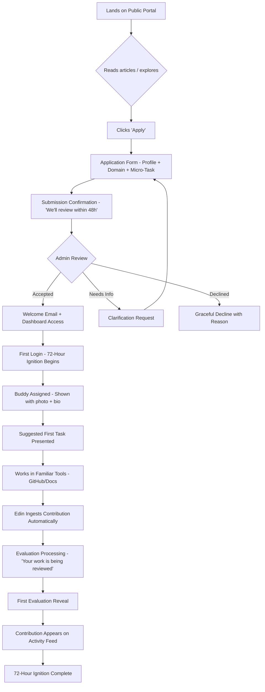
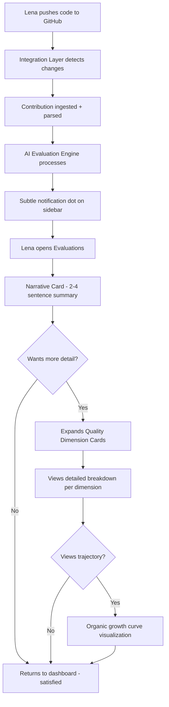
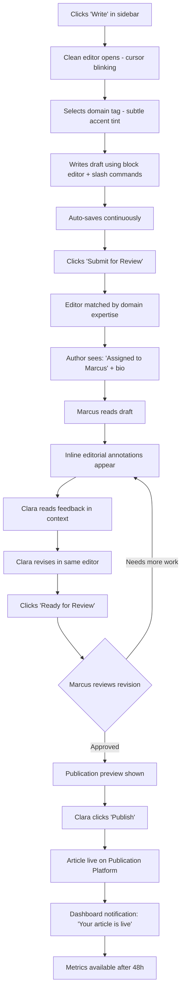
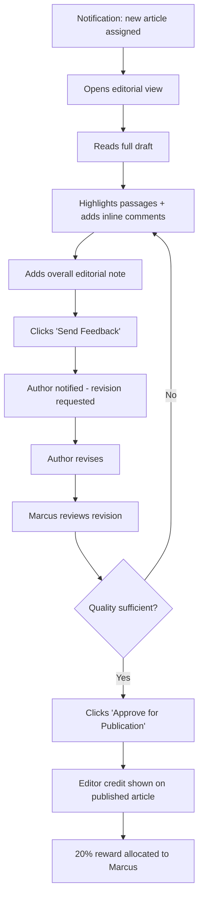
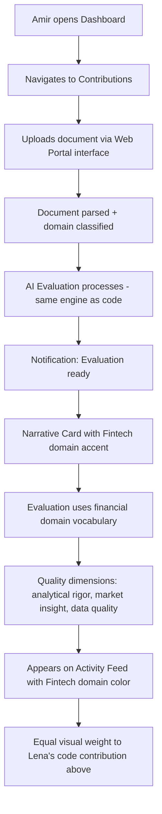
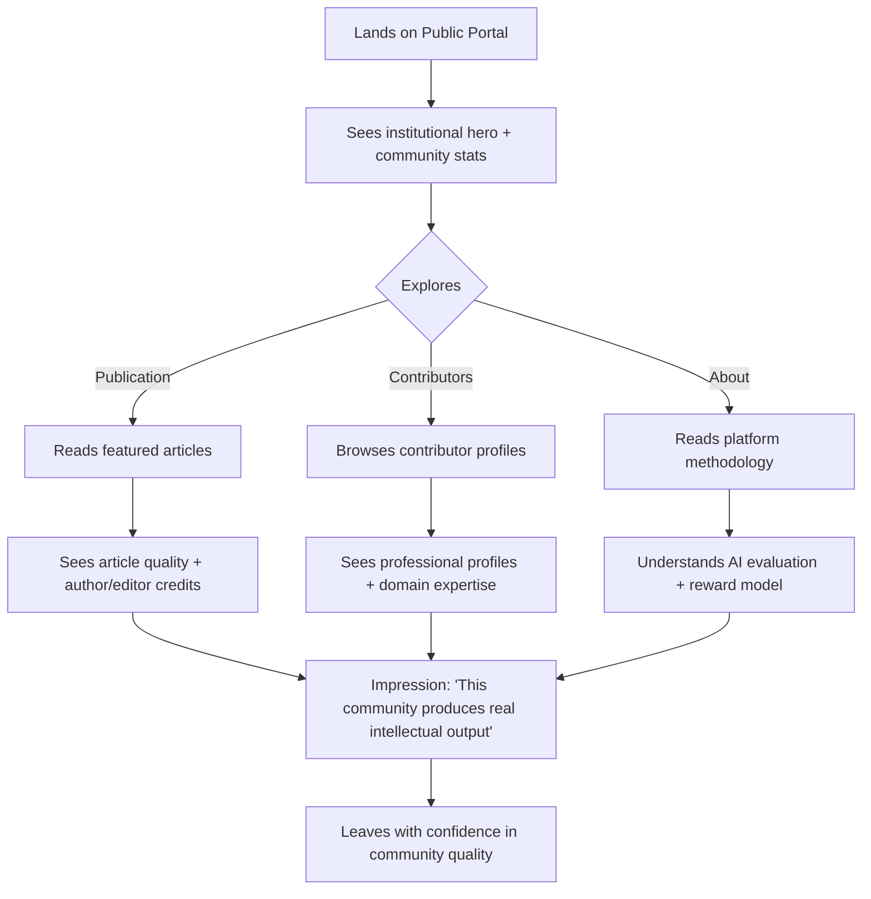

# UX Design Specification Edin

**Author:** Fabrice
**Date:** 2026-02-28

---

## Executive Summary

### Project Vision

Edin is a curated contributor platform for the Rose decentralized finance ecosystem that organizes, evaluates, rewards, and publishes collaborative development across four domains: Technology, Fintech, Impact, and Governance. The platform operates through six functional pillars — Integration Layer, Web Portal, AI Evaluation Engine, Multi-Scale Reward System, Governance Layer, and Publication Platform — serving a community of domain experts who contribute through existing tools while Edin provides the intelligence, reward, and publishing layers.

The Publication Platform — a modern think tank and community-driven publication — is core to the community growth strategy. Every piece of content has an Author and an Editor (who receives 20% of the author's reward), creating a structured incentive for editorial mentorship. The publication aims to rival the quality and authority of established publications like The Economist, produced entirely by a decentralized community of domain experts.

The UX must embody the founder's design vision: **beautiful, calming, insightful visuals** that translate complex information (AI evaluations, scaling-law rewards, contribution data) into experiences that feel like reading a beautifully designed publication rather than monitoring a dashboard. Multi-cultural visual language reflects the platform's universal roots (Edin — Sumerian for "fertile plain") and its global, multi-domain community.

### Target Users

**Primary Contributors (4 domain personas):**

- **Lena (Technology)** — Senior developer, values craft over quantity. Needs AI evaluation that recognizes quality work. Tech-savvy, uses GitHub daily. Wants to see the *craft* of her work reflected, not just commit counts.
- **Amir (Fintech)** — Financial engineer, non-developer. Needs equal domain standing alongside code contributions. Comfortable with data-rich interfaces but not developer tools. Contributes through documents and analyses.
- **Sofia (Impact)** — Impact analyst, values structural equality. Needs evidence that Impact is a real pillar. Comfortable with professional tools, expects institutional-quality interfaces.
- **Yuki (Governance)** — Governance specialist, deeply skeptical of performative decentralization. Needs transparent, traceable governance records. Detail-oriented, expects precision.

**Publication Personas:**

- **Clara (Author)** — Contributor who writes insightful articles. Needs a professional authoring experience with structured editorial support. Values seeing her ideas shaped and published to a quality standard.
- **Marcus (Editor)** — Experienced contributor who curates and shapes others' work. Needs editorial tools that feel professional and rewarding. Values visible editorial identity and mentorship.

**Operational Personas:**

- **Daniel (Applicant)** — Mid-level developer discovering Edin. Needs a clear, welcoming path from discovery to first contribution within 72 hours. Less experienced, needs guidance without condescension.
- **Marie (Admin)** — Platform operations lead. Needs efficient tools for admissions, metrics, and community health. Values operational clarity without information overload.
- **Henrik (Investor)** — Due diligence evaluator. Accesses public portal only (no auth). Needs transparent traction evidence — contributor quality, evaluation data, community health — presented with the authority and design quality of a professional investor relations page.

### Key Design Challenges

1. **Calming complexity** — The platform handles dense information (AI evaluation breakdowns, multi-temporal rewards, contribution attribution, editorial workflows) that could easily become overwhelming. The founder explicitly wants this translated into calming, beautiful visuals — not anxious dashboards. This is the defining UX tension: how to convey depth and transparency without triggering information anxiety.

2. **Four interface contexts, one coherent experience** — Public Portal (SEO, investors), Publication Platform (reading + authoring), Contributor Dashboard (evaluations, rewards, tasks), and Admin Dashboard (operations) must feel like one product while serving fundamentally different interaction modes and audiences.

3. **Multi-cultural visual inclusivity** — The community spans technology, finance, governance, and impact across global backgrounds. Visual language must avoid culturally narrow design idioms while maintaining warmth and authority. The name "Edin" references Sumerian, Hebrew, and Islamic traditions — the visual system should reflect this universality.

4. **Professional editorial experience** — The Publication Platform needs content creation and editorial workflows that feel like a professional publishing tool, while the reading experience must rival established publications in typography, layout, and visual elegance.

5. **Equal visual dignity across domains** — Technology, Fintech, Impact, and Governance must have architecturally equal visual weight. The design must actively resist the gravitational pull toward code-centric aesthetics that dominate contributor platforms.

### Design Opportunities

1. **"Insightful visuals" as differentiator** — If Edin translates complex evaluation data into genuinely beautiful, narrative-style visualizations (data journalism rather than dashboards), it becomes visually unmatched in the contributor platform space. The founder's vision points toward an editorial/journalistic visual language.

2. **Publication Platform as design showcase** — Published articles are the most public-facing content. Beautifully designed article pages become the platform's visual calling card — attracting contributors and readers through design quality alone.

3. **"The garden" metaphor as design foundation** — Edin means "fertile plain." The visual language can draw on organic, living-system metaphors (growth, cultivation, seasons) rather than mechanical ones (pipelines, funnels, engines), naturally producing the calming, insightful aesthetic the founder envisions.

## Core User Experience

### Defining Experience

**"See how your work was truly understood — and share that understanding with the world."**

Edin's core experience operates through two intertwined loops that share a common emotional center: the feeling that your contribution was genuinely comprehended and elevated.

**The Contribution Loop:** A contributor works with their familiar tools. Edin ingests the output. The AI Evaluation Engine analyzes the work and produces a transparent breakdown — not a score on a screen, but an insightful narrative about what the contribution achieved, what quality it demonstrated, and how it advanced the ecosystem. The contributor reads the evaluation and thinks: "It understood the craft." This understanding motivates the next contribution.

**The Publication Loop:** A contributor has an insight worth sharing. They write a draft. An Editor — a fellow contributor who understands the domain — shapes the piece through structured editorial feedback. The article transforms from rough expertise into polished, publication-quality prose. It goes live on the Publication Platform, beautifully typeset, and reaches readers beyond the Edin community. The author sees their ideas taken seriously, shaped with care, and read by people who matter. This visibility motivates the next article.

Both loops converge on the same moment: **understanding made visible**. The AI evaluation makes the quality of technical work visible. The editorial process makes the quality of intellectual insight visible. Edin's UX must make both forms of "being understood" feel calming, insightful, and beautiful — never anxious or metrics-driven.

### Platform Strategy

**Primary platform:** Web application (responsive)

- **Public Portal + Publication Platform:** Server-side rendered for SEO. Article reading experience optimized for all devices — mobile reading is a primary use case (people read articles on phones and tablets). Typography-first design approach.
- **Contributor Dashboard:** Single-page application for responsive interactions. Desktop-first design with full mobile support. Real-time updates for Activity Feed and evaluation notifications.
- **Admin Dashboard:** Desktop-optimized. Complex data tables and operational views. Mobile access for monitoring, not primary workflow.
- **Authoring/Editorial:** Desktop-first for writing and editing. Mobile for reviewing editorial feedback and managing workflow status.

**No offline requirement.** All interactions require network access for real-time data (evaluations, editorial feedback, contribution ingestion).

**No native app.** The web experience must be excellent enough that native wrappers add no value. Article reading experience should match native reading apps in typographic quality.

### Effortless Interactions

**What must feel completely natural:**

- **Contributing:** Zero workflow change. Work in GitHub, Google Docs, whatever tools you use. Edin ingests automatically. The contributor never "uploads to Edin" — their work appears because Edin is watching their tools, not the other way around.
- **Reading an evaluation:** The evaluation breakdown should read like a short editorial review of your work, not a grade report. No cognitive load to parse scores — the insight comes through narrative and gentle visual hierarchy, not dense metrics tables.
- **Reading a published article:** Opening an article should feel like opening The Economist or Aeon — immediate immersion in well-typeset prose with elegant layout. No platform chrome competing for attention. The content is the experience.
- **Starting as an Author:** The path from "I have an idea" to "I'm writing a draft" should be 2-3 clicks. The authoring interface should feel like a focused writing tool (Notion, Medium editor), not a form with fields.

**What should happen automatically:**

- Contribution ingestion from connected tools (no manual submission for code/docs)
- Editor assignment when an article is submitted (matched by domain expertise)
- Peer feedback assignment for new contributions
- Activity Feed updates as contributions and publications flow in
- Reward calculations and trajectory updates

### Critical Success Moments

1. **"The AI understood my craft"** (Lena moment) — When a contributor sees their evaluation breakdown and realizes the system recognized the quality and subtlety of their work. If this moment fails (evaluation feels mechanical or unfair), the platform loses its core differentiator. The UX must make this evaluation feel like a thoughtful assessment, not a test result.

2. **"My article looks like it belongs in a real publication"** (Clara moment) — When an author sees their published article on the Publication Platform for the first time and it looks genuinely beautiful — professional typography, elegant layout, author and editor profiles displayed with care. If this moment fails (article looks like a blog post or wiki entry), the "modern Economist" vision collapses.

3. **"I belong here"** (Daniel moment) — When a new contributor completes the 72-Hour Ignition and sees their first contribution on the Activity Feed alongside work from senior contributors. If this moment fails (onboarding feels bureaucratic or isolating), retention drops.

4. **"My domain has real weight"** (Amir/Sofia moment) — When a non-developer contributor sees their work displayed with equal visual prominence alongside code contributions. If this moment fails (the platform feels code-centric despite its four-pillar structure), the multi-domain equality thesis fails.

5. **"This community is real"** (Henrik moment) — When an investor accesses the public portal and sees a living, high-quality publication alongside contributor profiles and transparent metrics. If this moment fails (the public page looks like a startup landing page with vanity metrics), investor credibility collapses.

### Experience Principles

1. **Insight before numbers** — Never show a metric without context. Every data point should tell a story. An evaluation score is meaningless; an evaluation narrative that explains what the AI recognized about the contributor's craft is transformative. Lead with the insight, make the number available on demand.

2. **The page breathes** — Generous whitespace, deliberate pacing, content that reveals itself as you need it. No information overload. The design should feel like a curated exhibition, not a control panel. This directly embodies the founder's "calming, not nervous" directive.

3. **Equal by design, distinct by character** — All four domains share the same visual weight, layout patterns, and reward pathways. But each domain has its own visual character (color accent, subtle pattern language) that gives it identity without hierarchy. Technology doesn't look more important than Impact — they look different but equally dignified.

4. **Publication quality everywhere** — The typographic and layout standards of the Publication Platform should influence the entire design system. Contributor profiles, evaluation breakdowns, and even admin dashboards should feel editorially designed — as if every page were composed with the care of a magazine layout.

5. **The garden grows** — The platform should feel alive and growing, not static and administrative. Activity Feeds, contribution timelines, reward trajectories, and publication archives should evoke the sense of a living ecosystem — a garden being cultivated by many hands. Organic metaphors over mechanical ones.

6. **Warmth through substance** — Emotional warmth comes from treating contributors with intellectual respect, not from cheerful UI copy or gamification badges. The warmth of Edin is the warmth of being taken seriously — of having your work evaluated with care, your articles edited with attention, your domain treated with structural equality.

## Desired Emotional Response

### Primary Emotional Goals

**The Edin Emotional Signature: Calm Confidence**

Edin should make users feel the way you feel when reading a beautifully designed long-form article by someone who truly understands their subject — calm, engaged, intellectually stimulated, and confident that you're in the hands of people who care about quality. Not the anxiety of a performance dashboard. Not the dopamine hit of a social feed. The sustained, quiet satisfaction of being in a place where serious work is done with care.

Three primary emotional states:

1. **Intellectual respect** — "This platform treats me as a serious professional." Every interaction — from the evaluation breakdown to the publication layout to the admin dashboard — communicates that the people behind Edin respect the intelligence of their users. No condescension, no gamification tricks, no infantilizing onboarding wizards. The design assumes competence and rewards attention.

2. **Calm clarity** — "I can see everything I need without feeling overwhelmed." Complex information (AI evaluations, reward trajectories, editorial feedback, community health) is presented through progressive disclosure: the insight first, the detail on demand. The visual environment is spacious, unhurried, and deliberately paced. Contributors should feel the opposite of dashboard anxiety.

3. **Belonging through contribution** — "My work matters here, and I can see the evidence." The platform makes the impact of each contributor's work visible — not through vanity metrics or leaderboards, but through the narrative quality of evaluations, the editorial care given to publications, and the equal visual dignity afforded to every domain.

### Emotional Journey Mapping

| Stage | Desired Feeling | Design Implication |
|---|---|---|
| **Discovery** (Henrik, Daniel) | Quiet authority — "These people are serious" | Public portal and Publication Platform project institutional quality, not startup energy. Published articles demonstrate intellectual depth. Contributor roster shows real professionals, not avatar walls |
| **Application** (Daniel) | Respectful challenge — "They care who joins" | Micro-task application feels like an invitation to demonstrate competence, not a gatekeeping hurdle. Clear expectations, dignified process |
| **Admission** (Daniel) | Welcome without ceremony — "I'm part of something real" | 72-Hour Ignition onboarding is warm but substantive. No confetti animations. The warmth comes from a real person (buddy) and a meaningful first task |
| **First contribution** (All contributors) | Anticipatory calm — "I'm curious to see how this is received" | After submission, the contributor sees a clear status ("evaluation in progress") without anxious waiting. No countdown timers or urgency signals |
| **Seeing evaluation** (Lena, Amir, Sofia) | Recognition of craft — "It understood what I did" | The evaluation breakdown reads like a thoughtful review, not a report card. Narrative first, scores secondary. The contributor feels *seen*, not graded |
| **Publishing an article** (Clara) | Creative pride — "This is the best version of my thinking" | The published article looks beautiful. The author's name, the editor's name, the domain tag — all displayed with the care of a byline in a quality publication |
| **Editing an article** (Marcus) | Mentorship satisfaction — "I helped shape something meaningful" | The editorial interface shows the arc from draft to publication. The editor sees their impact not as tracked changes but as a narrative of improvement |
| **Returning daily** (All contributors) | Steady engagement — "There's always something worth seeing" | The Activity Feed and Publication stream are curated, not noisy. Quality over quantity. Each item earns its place on the page |
| **Viewing rewards** (All contributors) | Patient confidence — "My sustained engagement is building something" | Reward trajectory visualizations show growth curves, not point totals. The compounding nature of scaling-law rewards is communicated through visual metaphors of organic growth, not gamification bars |
| **Something goes wrong** (All users) | Supported resilience — "The system has my back" | Errors are communicated with clarity and empathy. "Your contribution is being retried" not "Ingestion failed." The system takes responsibility, not the user |

### Micro-Emotions

**Critical emotional states to cultivate:**

- **Trust over skepticism** — Yuki (the governance skeptic) is the design litmus test. If the platform earns Yuki's trust through transparent governance records and credible decentralization milestones, it earns everyone's trust. Design implication: every claim must be backed by visible evidence. No marketing language in the authenticated experience.

- **Confidence over confusion** — Amir (the non-developer) is the accessibility litmus test. If Amir can navigate contribution, evaluation, and reward flows without developer-specific knowledge, the platform is truly multi-domain. Design implication: no jargon-dependent interfaces, no code-centric metaphors in shared spaces.

- **Accomplishment over frustration** — Daniel (the applicant) is the onboarding litmus test. If Daniel feels accomplished within 72 hours rather than overwhelmed by unfamiliar processes, the 72-Hour Ignition works. Design implication: guided but not patronizing, structured but not rigid.

- **Belonging over isolation** — Sofia (the impact analyst) is the equality litmus test. If Sofia's impact assessment has the same visual dignity and presence as Lena's code refactoring, multi-domain equality is real. Design implication: no visual hierarchy between contribution types.

- **Creative pride over performance anxiety** — Clara (the author) is the publication litmus test. If Clara feels creative pride when she sees her published article rather than performance anxiety about metrics, the Publication Platform has the right emotional tenor. Design implication: publication metrics are secondary to the quality of the reading experience.

**Emotions to actively prevent:**

- **Dashboard anxiety** — The feeling of being monitored by numbers. Prevented by: narrative-first evaluation, progressive disclosure, generous whitespace, no red/green scoring.
- **Imposter syndrome** — The feeling of not belonging. Prevented by: welcoming onboarding, buddy system, contributions displayed alongside (not below) senior work.
- **Competitive tension** — The feeling that others' success diminishes yours. Prevented by: no leaderboards, no ranking, no comparative metrics. Every contributor's journey is individual.
- **Publication pressure** — The feeling that you must publish or lose standing. Prevented by: publication is an opportunity, not a requirement. No "days since last article" counters.

### Design Implications

| Emotional Goal | UX Approach |
|---|---|
| Intellectual respect | Typography-forward design. Serif headings for editorial contexts. Long-form readable content. No emoji or casual iconography in professional spaces. Contributor profiles that look like author biographies, not social media cards |
| Calm clarity | Progressive disclosure: summary → detail on click/expand. Generous whitespace (minimum 24px between content blocks). Muted color palette with deep, warm tones. No animation for animation's sake — motion only to communicate state changes |
| Belonging through contribution | Activity Feed that shows contributions chronologically without ranking. Domain color accents that give identity without hierarchy. "Your Fingerprints" section on contributor profile that shows where their work has had impact |
| Recognition of craft | Evaluation breakdowns that open with a narrative paragraph ("Your refactoring reduced complexity by...") before showing any scores. Scores displayed as subtle indicators, not bold numbers |
| Creative pride | Published articles with beautiful typography, generous margins, author/editor credits displayed like bylines. Article pages that feel like a standalone publication, not a platform subpage |
| Patient confidence | Reward trajectory shown as a growth curve visualization with organic, gardening-inspired visual language. "Your garden is growing" not "Your score is 847" |

### Emotional Design Principles

1. **Evidence before claims** — Never tell users to feel something; show them evidence that creates the feeling naturally. Don't say "your work is valued" — show them an evaluation that demonstrates deep understanding of their contribution. Don't say "this is a quality publication" — design article pages so beautifully that the quality is self-evident.

2. **Dignity in every interaction** — Every touchpoint treats the user as an intelligent professional. Error messages explain what happened and what's being done. Empty states explain what will appear and why. Loading states communicate progress, not anxiety. No cheerful copy masking system limitations.

3. **Emotional safety for vulnerability** — Contributing work and publishing articles are acts of vulnerability. The platform must create emotional safety through predictable processes, clear expectations, and private feedback before public visibility. An evaluation is shared with the contributor first, never publicly without their contribution being visible. Editorial feedback is private between author and editor.

4. **Warmth through substance** — The emotional warmth of Edin comes not from bright colors, friendly illustrations, or casual tone — it comes from the substance of what the platform delivers: evaluations that show genuine understanding, editorial feedback that genuinely improves work, rewards that genuinely compound. Substance is warmth.

5. **Anticipatory reassurance** — At every point where a user might feel uncertain ("Did my contribution upload?" "When will I hear back?" "Is my article being reviewed?"), provide proactive status information before they need to ask. Calm confidence requires knowing where things stand without having to chase information.

## UX Pattern Analysis & Inspiration

### Inspiring Products Analysis

**1. The Economist (Digital Edition) — Editorial Authority & Reading Experience**

- **Core UX strength:** Transforms dense, complex global analysis into calm, authoritative reading experiences. The reader never feels overwhelmed despite the depth of content. Typography, whitespace, and visual hierarchy do the heavy lifting — the design says "this is serious" without saying "this is stressful."
- **Onboarding:** Minimal. The content speaks for itself. New readers are drawn in by article quality, not by guided tours.
- **Navigation & information hierarchy:** Section-based (Finance, Science, Culture) with equal visual weight — no section dominates. Article pages strip away navigation chrome, creating an immersive reading tunnel. This directly maps to Edin's four-domain equality requirement.
- **Visual design choices:** Serif typography for authority. Red accent used sparingly for brand identity, not for alerts. Illustrations are editorial (commissioned, conceptual) rather than stock or decorative. Dense information presented through curated editorial judgment, not raw data dumps.
- **What keeps users returning:** The feeling of being well-informed without being overwhelmed. Intellectual stimulation wrapped in visual calm.
- **Relevance to Edin:** The Publication Platform's reading experience should aim for this exact emotional register. Article pages, evaluation narratives, and contributor profiles should all inherit this editorial design DNA.

**2. Stripe Documentation & Dashboard — Calm Complexity**

- **Core UX strength:** Makes extraordinarily complex financial/technical information feel manageable and even elegant. The dashboard communicates serious data without triggering anxiety. Progressive disclosure is masterful — summary views that expand into detail without context switching.
- **Onboarding:** Gradual capability reveal. New users see a simplified view that grows in complexity as they use more features. No information overload on day one.
- **Navigation & information hierarchy:** Left sidebar navigation with clear grouping. Content area uses generous whitespace and consistent typography hierarchy. Data visualizations are minimal and purposeful — small charts that tell one story clearly rather than dense multi-axis dashboards.
- **Innovative interactions:** API documentation that feels like reading a well-written technical book. Inline examples that run. Status indicators that communicate health without alarm.
- **Visual design choices:** Neutral, airy palette with strategic color accents. Typography is clean and spacious. Gradients and subtle depth (not flat, not skeuomorphic — a calm middle ground).
- **Relevance to Edin:** The Contributor Dashboard should learn from Stripe's ability to present complex data (evaluations, rewards, trajectories) with calm clarity. Progressive disclosure pattern is directly transferable for evaluation breakdowns.

**3. Are.na — Community Curation & Equal Dignity**

- **Core UX strength:** A platform where visual art, research, code, essays, and links all coexist with equal visual weight. No content type dominates. The design treats every contribution with the same quiet respect, regardless of format. This is the closest existing model to Edin's multi-domain equality aspiration.
- **Navigation:** Channel-based organization that creates contexts without hierarchy. Every contributor's collection looks the same — the design doesn't privilege any user over another.
- **Visual design choices:** Monochromatic, grid-based, deliberately minimal. Content speaks for itself. No gamification, no follower counts, no trending algorithms. The anti-social-media aesthetic.
- **What keeps users returning:** The feeling of being part of an intellectual community that values curation over consumption. Quality over popularity.
- **Relevance to Edin:** Are.na demonstrates that a platform can treat diverse contribution types (code, documents, analyses, governance proposals) with equal visual dignity. Its anti-gamification philosophy aligns perfectly with Edin's "no leaderboards, no competitive tension" principle. The contributor profile model — showing what you've curated rather than how popular you are — maps to Edin's "Your Fingerprints" concept.

**4. Notion — Authoring Experience & Structured Content**

- **Core UX strength:** Makes content creation feel effortless through block-based editing with slash commands. The transition from blank page to structured document is smooth and never intimidating. Writing feels like thinking, not like filling out forms.
- **Innovative interactions:** Slash command menu that surfaces capabilities contextually. Inline embedding. Template system that provides structure without constraining creativity. Toggle blocks for progressive disclosure within authored content.
- **Visual design choices:** Clean, minimal chrome. The content area dominates. Sidebar navigation collapses to maximize writing space. Typography optimized for readability during both editing and reading.
- **Relevance to Edin:** The Publication Platform's authoring experience should feel this natural. Clara (the author) should experience the same "writing feels like thinking" flow. The editorial feedback layer should integrate as seamlessly as Notion's commenting system — present when needed, invisible when writing.

**5. Aeon Magazine — Long-Form Visual Storytelling**

- **Core UX strength:** Proves that serious intellectual content can be presented with visual beauty that enhances rather than distracts from the ideas. Full-bleed imagery, pull quotes, and typographic variation create rhythm in long-form reading.
- **Visual design choices:** Large-format photography and illustration as article headers. Generous line-height and readable measure (characters per line). Section breaks that give the reader breathing room. Author profiles that feel like introductions to real people, not database entries.
- **Relevance to Edin:** Aeon demonstrates the "Publication quality everywhere" principle — that editorial design standards can elevate even the simplest content presentation. The article page template and author/editor profile treatment should draw from this tradition. Multi-cultural imagery (Aeon covers global perspectives) also maps to Edin's multi-cultural visual language requirement.

### Transferable UX Patterns

**Navigation Patterns:**

- **Section equality architecture** (from The Economist) — Four domain sections (Technology, Fintech, Impact, Governance) with identical structural treatment, distinct identity through color accent and subtle motif, but no visual hierarchy. Directly solves the "equal dignity across domains" challenge.
- **Progressive navigation collapse** (from Notion) — Sidebar that collapses during focused tasks (reading articles, viewing evaluations, writing) to create immersive content zones. Navigation chrome disappears when the content is the experience.
- **Contextual interface switching** (from Stripe) — Smooth transitions between the four interface contexts (Public, Publication, Contributor, Admin) without jarring visual breaks. Shared design vocabulary, different information density.

**Interaction Patterns:**

- **Narrative-first data presentation** (from Stripe + The Economist) — Evaluation breakdowns that open with a narrative paragraph (what the AI recognized about the contributor's craft) before revealing detailed scores. The insight comes through story, the data supports it. Directly implements "Insight before numbers."
- **Progressive disclosure cards** (from Stripe) — Summary cards on the Contributor Dashboard that expand to reveal evaluation detail, reward trajectory, or contribution history. No page transitions for exploration — the information unfolds in place.
- **Block-based authoring with slash commands** (from Notion) — Publication Platform editor that uses familiar block-based editing patterns. Slash commands for inserting code blocks, data visualizations, pull quotes. Reduces authoring friction to near-zero.
- **Inline editorial feedback** (adapted from Notion comments + Google Docs suggestions) — Editor feedback that appears contextually within the article draft, not in a separate feedback panel. The editorial conversation happens alongside the text it references.

**Visual Patterns:**

- **Typographic hierarchy as primary design language** (from The Economist + Aeon) — Serif headings for editorial content (articles, evaluations, profiles), sans-serif for interface elements (navigation, buttons, data). This dual-typographic approach naturally creates the "publication quality everywhere" effect while distinguishing content from chrome.
- **Breathing whitespace system** (from Are.na + Stripe) — Systematic spacing that enforces the "page breathes" principle. Minimum 24px between content blocks, 48px between sections. Content never feels cramped.
- **Organic data visualization** (inspired by garden metaphor) — Reward trajectories and contribution timelines rendered as growth curves with organic, botanical visual language. Not bar charts and line graphs — visual metaphors that evoke cultivation, seasons, and living systems.
- **Multi-cultural visual palette** (from Aeon + The Economist global editions) — Color palette and illustration style that draws from diverse visual traditions. Warm earth tones, muted jewel tones, and natural gradients that reference global design traditions without appropriating specific cultural motifs.

### Anti-Patterns to Avoid

- **Dashboard-ification** — Filling contributor views with KPI cards, percentage changes, and red/green indicators. This is the single biggest threat to the "Calm Confidence" emotional signature. GitHub's contribution graph and its anxiety-inducing "streak" culture is the anti-model. Edin should never make contributors feel like they're being performance-monitored.

- **Social media engagement metrics** — Follower counts, like buttons, share counters, or trending algorithms on the Publication Platform. These create competitive tension and reduce editorial quality to popularity metrics. Mirror.xyz and Medium both fell into this trap, undermining editorial credibility with engagement gamification.

- **Code-centric aesthetics in shared spaces** — Monospace fonts, terminal-style interfaces, or developer-tool metaphors in spaces shared by all four domains. This accidentally signals "this is a developer platform" and alienates Amir (fintech), Sofia (impact), and Yuki (governance). Even subtle choices — like using "deploy" instead of "publish" or showing raw JSON in evaluation breakdowns — violate domain equality.

- **Wizard-style onboarding** — Step-by-step guided tours with tooltips pointing at interface elements. These feel patronizing to the serious professionals Edin serves. Daniel's 72-Hour Ignition should feel like an invitation to contribute, not a software tutorial.

- **Notification overload** — Badge counts, push notifications for every activity, or "you haven't contributed in X days" nudges. These create the anxious monitoring feeling the founder explicitly rejected. Activity should be discoverable, not pushed.

- **Vanity empty states** — Cheerful illustrations with "Nothing here yet! Start contributing!" copy. Empty states should be informative and dignified: what will appear here, why it matters, and what conditions produce content.

### Design Inspiration Strategy

**What to Adopt:**

- **The Economist's editorial authority** — The typographic confidence, section equality, and calm-despite-complexity approach. Adopt directly for the Publication Platform reading experience and extend across the entire design system. Articles, evaluation narratives, and contributor profiles should all feel editorially composed.
- **Stripe's progressive disclosure** — The pattern of summary → expandable detail for complex data. Adopt for evaluation breakdowns, reward trajectories, and admin dashboards. This is the primary mechanism for achieving "calm clarity" with dense information.
- **Are.na's contribution equality** — The visual treatment that gives every content type equal dignity. Adopt for the Activity Feed and contributor profile views where diverse contribution types (code, documents, analyses, proposals) must coexist without hierarchy.

**What to Adapt:**

- **Notion's block editor → Publication authoring** — Adapt the familiar block-based editing pattern for the Publication Platform, but layer in editorial workflow features (submission status, editor feedback inline, revision history). The writing experience is Notion-like; the editorial layer is unique to Edin.
- **Aeon's visual storytelling → Evaluation narratives** — Adapt the visual rhythm of long-form articles (pull quotes, breathing room, typographic variation) for AI evaluation breakdowns. An evaluation should read with the same visual cadence as a well-designed article, not a report.
- **Stripe's data visualization → Garden-inspired metrics** — Adapt Stripe's clean, purposeful data visualization approach but replace the fintech aesthetic with organic, botanical visual metaphors. Growth curves that feel like watching a garden develop, not tracking stock prices.

**What to Avoid:**

- **GitHub's contribution tracking model** — Green squares, streak counts, and commit-frequency visualization. This creates exactly the "metrics and nervousness" the founder rejected.
- **Medium's social-engagement layer** — Claps, follower counts, and recommendation algorithms that reduce editorial quality to popularity. Edin's Publication Platform values editorial judgment (the Editor role) over crowd engagement.
- **Slack's notification urgency model** — Badge counts, unread indicators, and "catch up" pressure. Edin's Activity Feed should be a calm stream to browse, not an inbox to clear.
- **Traditional admin dashboard patterns** — Dense data tables with filter dropdowns and export buttons. Even Marie (admin) deserves the "calm clarity" treatment — operational dashboards should use the same editorial design language as the rest of the platform.

## Design System Foundation

### Design System Choice

**Approach: Themeable Headless System — Tailwind CSS + Radix UI**

Edin uses a **headless component library (Radix UI) styled through a utility-first CSS framework (Tailwind CSS)**, creating a design system that provides accessibility and interaction patterns out of the box while allowing complete visual control. This is the "Themeable System" approach, chosen specifically because Edin's visual identity — editorial typography, organic data visualization, multi-cultural palette — cannot be achieved by skinning an opinionated component library like Material Design or Ant Design.

**The system operates in three layers:**

1. **Radix UI (Behavior layer)** — Provides accessible, unstyled primitives for complex interactive components: dialogs, dropdowns, tabs, accordions, tooltips, navigation menus. These handle keyboard navigation, screen reader announcements, focus management, and ARIA attributes. Zero visual opinions — every pixel is Edin's to design.

2. **Tailwind CSS (Style layer)** — Utility-first framework that compiles to optimized CSS. Design tokens (colors, spacing, typography, shadows) are defined in the Tailwind configuration and used consistently across all components. No CSS naming conventions to argue about, no style drift across contributors.

3. **Edin Component Library (Composition layer)** — Custom React components that combine Radix primitives with Tailwind styling to create Edin-specific patterns: Evaluation Narrative Cards, Article Page Layouts, Contributor Profile Views, Activity Feed Items, Domain-tagged Content Blocks. This is where Edin's editorial design language lives.

### Rationale for Selection

**Why not a fully custom design system:**

- Edin's MVP timeline requires speed. Building accessible dialog management, keyboard navigation, and screen reader support from scratch would consume months of engineering with no visible UX benefit. Radix provides this invisible foundation.
- Accessibility is non-negotiable (NFR requirements). Radix's accessibility compliance is battle-tested across thousands of production applications.

**Why not an opinionated system (Material Design, Ant Design, Chakra UI):**

- Edin's visual identity — editorial serif typography, organic data visualizations, breathing whitespace, multi-cultural color palette — is fundamentally incompatible with the visual language of Material Design (geometric, industrial) or Ant Design (corporate, data-dense).
- The "modern Economist" reading experience requires typographic control that opinionated systems resist. Fighting against Material Design's typography system to achieve editorial typography is worse than starting from a clean slate.
- The four interface contexts (Public Portal, Publication Platform, Contributor Dashboard, Admin Dashboard) need distinct visual registers within one system. Opinionated libraries make this difficult because their consistency model fights contextual variation.

**Why Tailwind CSS + Radix UI specifically:**

- **Full typographic control** — Tailwind's typography plugin (`@tailwindcss/typography`) combined with custom font definitions supports the dual-typography approach (serif for editorial content, sans-serif for interface elements) identified in Step 5.
- **Design token architecture** — Tailwind's configuration file becomes the single source of truth for Edin's design tokens: the domain color accents, the multi-cultural palette, the breathing whitespace scale, the organic border-radius values.
- **SSR compatibility** — Both Tailwind (CSS only, no runtime) and Radix (server-component compatible) work with Edin's hybrid SPA/SSR architecture. Critical for the Publication Platform and Public Portal, which require server-side rendering for SEO.
- **Responsive without compromise** — Tailwind's responsive utilities allow the four interface contexts to adapt to their optimal device (mobile-first for article reading, desktop-first for authoring, desktop-optimized for admin) within a single design token system.

### Implementation Approach

**Design Token Architecture:**

```
tailwind.config.js
├── colors/
│   ├── brand (Edin primary palette — warm, muted, earthy)
│   ├── domain.technology (accent color for Technology domain)
│   ├── domain.fintech (accent color for Fintech domain)
│   ├── domain.impact (accent color for Impact domain)
│   ├── domain.governance (accent color for Governance domain)
│   ├── semantic (success, warning, info — never red/green for scoring)
│   └── surface (backgrounds, cards, borders — warm neutrals)
├── typography/
│   ├── serif (editorial: articles, evaluations, profiles)
│   ├── sans (interface: navigation, buttons, labels)
│   └── mono (code contexts only — never in shared spaces)
├── spacing/
│   ├── breathing (24px, 32px, 48px, 64px — generous content spacing)
│   └── compact (8px, 12px, 16px — interface element spacing)
├── borderRadius/
│   ├── organic (soft, natural curves — default for cards and containers)
│   └── sharp (minimal radius — for buttons and interactive elements)
└── shadows/
    └── subtle (light, warm-toned shadows — depth without drama)
```

**Component Architecture:**

```
components/
├── primitives/          ← Radix UI + Tailwind styling
│   ├── Dialog/
│   ├── Dropdown/
│   ├── Tabs/
│   ├── Accordion/       ← Progressive disclosure pattern
│   └── Tooltip/
├── editorial/           ← Publication-quality components
│   ├── ArticlePage/
│   ├── AuthorByline/
│   ├── EditorCredit/
│   ├── PullQuote/
│   └── ArticleCard/
├── evaluation/          ← Narrative-first data components
│   ├── EvaluationNarrative/
│   ├── ScoreIndicator/  ← Subtle, secondary to narrative
│   ├── RewardTrajectory/ ← Organic growth visualization
│   └── ContributionTimeline/
├── community/           ← Contributor & activity components
│   ├── ContributorProfile/
│   ├── ActivityFeedItem/
│   ├── DomainBadge/     ← Equal-weight domain indicators
│   └── YourFingerprints/
├── authoring/           ← Block-based editor components
│   ├── BlockEditor/
│   ├── SlashCommandMenu/
│   ├── InlineEditorialFeedback/
│   └── RevisionHistory/
└── layout/              ← Context-specific layouts
    ├── PublicLayout/     ← SSR, SEO-optimized
    ├── PublicationLayout/ ← Immersive reading, minimal chrome
    ├── DashboardLayout/  ← SPA, sidebar navigation
    └── AdminLayout/      ← Desktop-optimized, data-friendly
```

### Customization Strategy

**Four Interface Contexts, One Token System:**

Each interface context shares the same design tokens but applies them with different visual intensity:

| Context | Typography Emphasis | Spacing | Chrome Level | Color Intensity |
|---|---|---|---|---|
| **Public Portal** | Serif-dominant, editorial | Very generous | Minimal — content-first | Warm, muted — institutional authority |
| **Publication Platform** | Serif for reading, sans for authoring tools | Generous for reading, compact for editor | Zero chrome during reading, tool-level for authoring | Rich, editorial — article headers and domain accents |
| **Contributor Dashboard** | Mixed — narrative serif for evaluations, sans for interface | Breathing — 24px minimum between blocks | Moderate — sidebar nav + content area | Domain accents as identity, warm neutrals as base |
| **Admin Dashboard** | Sans-dominant, data-readable | Compact but not cramped | Functional — tables, filters, but editorially designed | Neutral with semantic accents for status |

**Domain Color System:**

Four domain accents that provide identity without hierarchy. Each accent is derived from a warm, muted palette inspired by natural materials and multi-cultural design traditions:

- **Technology** — Deep teal (evokes precision and depth, avoids "developer blue")
- **Fintech** — Warm amber (evokes value and stability, avoids "money green")
- **Impact** — Terra rose (evokes earth and warmth, avoids "charity/NGO blue")
- **Governance** — Slate violet (evokes wisdom and structure, avoids "government grey")

These accents are used for: domain badges, section headers, subtle background tints on domain-specific content, and the contributor profile domain indicator. They are never used for status or scoring.

**Responsive Strategy:**

- Article reading: fluid typography (clamp-based), optimal measure (60-75 characters per line), mobile-first
- Contributor dashboard: responsive grid, sidebar collapses to bottom nav on mobile, cards stack vertically
- Admin dashboard: desktop-first, horizontal scroll for wide tables on mobile, simplified views for monitoring
- Authoring: desktop-first editor with mobile review capabilities

## Defining Interactions

### The Defining Experience

**"See how your work was truly understood — and share that understanding with the world."**

If someone asks an Edin contributor what makes the platform different, the answer is: *"It actually understands what you did."* And if they're also an author: *"And it helps you publish your thinking beautifully."*

**The Defining Interaction — two forms of the same experience:**

**Form 1: The Evaluation Reveal** — A contributor checks their latest evaluation. Instead of a score or a grade, they read a narrative — a paragraph that describes what the AI recognized about their work: the architectural decision that simplified complexity, the financial model that accounted for edge cases, the governance proposal that balanced competing interests. The contributor thinks: *"It understood the craft."* This is Edin's equivalent of Tinder's swipe — the moment that, if it works, creates an emotional hook that drives everything else.

**Form 2: The Publication Moment** — An author sees their article live on the Publication Platform. The typography is elegant. Their name and their editor's name sit under the title like a byline in The Economist. The domain tag (Technology, Fintech, Impact, Governance) gives it context. The article looks like it belongs in a serious publication, because it does. The author thinks: *"My ideas look as good as they deserve."*

Both forms produce the same emotional payload: **recognition of quality through visible understanding**.

### User Mental Model

**How contributors currently experience evaluation:**

Contributors come from a world where work evaluation means one of two things: (1) automated metrics that measure quantity, not quality (lines of code, number of commits, story points closed), or (2) subjective human reviews that are inconsistent, delayed, and often political. Their mental model is: "evaluation = judgment, and judgment is usually crude or unfair."

Edin must break this model. The evaluation reveal should feel like receiving a thoughtful review from someone who genuinely read your work — not like checking a grade. The user's expectation shifts from "How did I score?" to "What did it see?"

**How authors currently experience publishing:**

Authors come from a world where professional publishing means either: (1) traditional editorial gatekeeping (journals, newspapers) with months-long processes and opaque decisions, or (2) self-publishing (Medium, blogs) with no editorial support and no quality signal. Their mental model is: "publishing = either gatekept or anarchic."

Edin breaks this too. The Publication Platform offers structured editorial mentorship (the Editor role) without gatekeeping (any contributor can write). The author's expectation shifts from "Will they accept my piece?" to "How will the editor help me make it better?"

**How readers currently experience contributor platforms:**

External readers (Henrik, potential contributors) expect contributor platforms to look like tech dashboards — GitHub profiles, StackOverflow stats, LinkedIn endorsements. Their mental model is: "contributor platform = metrics wall."

Edin's public face — the Publication Platform and contributor profiles — should break this expectation by looking like a publication first and a platform second. The reader's reaction should be: "Wait, this is written *by* contributors?"

### Success Criteria

**The Evaluation Reveal succeeds when:**

- The contributor reads the evaluation narrative *before* looking for a score — because the narrative is more interesting than the number
- The evaluation references specific aspects of the work that feel accurate and insightful — not generic
- The contributor shares the evaluation insight with a colleague or in their domain (not the score, the insight)
- Reading the evaluation takes 30-60 seconds — long enough to feel substantive, short enough to feel effortless
- The contributor feels motivated to contribute again, not because of the score, but because they were understood

**The Publication Moment succeeds when:**

- The author shares the article link externally (social media, professional network) with pride in how it looks
- External readers cannot tell the article was written on a contributor platform — it looks like an independent publication
- The editor's name alongside the author's feels like a mark of quality, not a co-authorship claim
- The article page loads fast (<1.2s FCP) and looks beautiful on mobile — because articles are shared and read on phones

**The Daily Return succeeds when:**

- Contributors open Edin to browse, not to check — the Activity Feed and Publication stream feel like reading a curated publication, not clearing an inbox
- Time spent correlates with content quality, not notification pressure — no "catch up" anxiety
- Contributors discover others' work through the feed and feel inspired, not competitive

### Novel UX Patterns

**Novel — The Narrative Evaluation:**

This is Edin's most innovative interaction pattern. No existing platform presents AI-generated work evaluation as a readable narrative with progressive disclosure to supporting data. The closest analogues are:

- Code review comments (GitHub) — but these are human-written and attached to specific lines, not holistic
- Performance review narratives (corporate HR tools) — but these are periodic, not per-contribution
- AI-generated summaries (ChatGPT, Notion AI) — but these are user-initiated, not systematic evaluations

**Edin's approach:** Each contribution receives an AI-generated evaluation that opens as a narrative paragraph (2-4 sentences describing what the AI recognized), followed by expandable detail sections (quality dimensions, comparison to contributor's trajectory, domain-specific criteria). The narrative is the primary interface; the data supports it through progressive disclosure.

**Teaching the pattern:** No explicit teaching needed. The narrative-first format leverages the universal mental model of "reading a review." Contributors will naturally read the narrative first because it's the most prominent element. The progressive disclosure (click to expand detailed scores) follows the familiar "summary → detail" pattern from news articles.

**Adapted — The Editorial Workflow:**

The Publication Platform's Author → Editor → Publish flow combines familiar patterns in an Edin-specific way:

- **Familiar:** Block-based authoring (from Notion), inline comments for editorial feedback (from Google Docs), submission/review status tracking (from journal management systems)
- **Novel combination:** The editor is a peer contributor (not a professional editor), matched by domain expertise. The 80/20 reward split makes editorial work a first-class contribution, not volunteer labor. The editorial feedback appears inline within the article draft alongside the AI's content evaluation — combining human editorial judgment with AI quality assessment.

**Established — Everything Else:**

The remaining interactions use proven patterns:

- Sidebar navigation for dashboard (Stripe pattern)
- Activity Feed as reverse-chronological stream (familiar social/professional pattern, but without engagement metrics)
- Profile pages as professional portfolios (LinkedIn/portfolio pattern, but with editorial design quality)
- Application flow as guided multi-step form (standard pattern, but with dignity-first UX copy)
- Admin tables and filters (standard operational pattern, but with editorial design language)

### Experience Mechanics

**1. The Evaluation Reveal — Step by Step:**

**Initiation:**

- Trigger: A new evaluation is ready. A subtle indicator appears in the sidebar navigation (a warm-toned dot, not a badge count). The Activity Feed shows a new item: "Your contribution to [project] has been evaluated."
- The contributor clicks through to the evaluation. No urgency signals — the evaluation waits patiently.

**Interaction:**

- The evaluation opens with a **Narrative Card** — a visually prominent block styled like an editorial pull quote. 2-4 sentences describing what the AI recognized. Serif typography, generous whitespace. This is the hero element of the page.
- Below the narrative: **Quality Dimension Cards** — expandable accordion sections (Radix Accordion primitive) for each evaluation dimension (quality, complexity, domain impact, etc.). Each shows a one-line summary; expanding reveals the detailed breakdown. Scores appear as subtle progress indicators within the expanded view, never as headline numbers.
- Side panel or below: **Trajectory Context** — a small organic visualization showing how this contribution fits into the contributor's overall trajectory. Growth curve style, not bar chart. "Your garden is growing" visual language.

**Feedback:**

- The narrative itself is the primary feedback — reading it should feel rewarding regardless of the specific score.
- Quality dimensions use warm, descriptive labels ("Strong architectural clarity," "Growing domain fluency") rather than numerical grades.
- If the evaluation identifies areas for growth, the language is encouraging and specific: "Your next contribution could explore [specific technique]" — not "Area for improvement: [metric]."

**Completion:**

- The contributor can bookmark the evaluation, return to the dashboard, or navigate to their trajectory view. No prompt to "rate this evaluation" or "share your result."
- The evaluation remains accessible on the contributor's profile under a "Reflections" or "Journey" section — framed as part of their growth narrative, not a scorecard history.

**2. The Publication Flow — Step by Step:**

**Initiation:**

- From the Contributor Dashboard: a "Write" action in the sidebar (not a button labeled "Create Article" — the verb is the invitation). Clicking opens the Publication authoring environment.
- The authoring environment is a clean, distraction-free block editor. No sidebar, no toolbar clutter. A blinking cursor on a beautiful blank page with the contributor's name pre-filled as author.

**Interaction — Writing:**

- Block-based editor with slash commands for structure (heading, quote, code block, image, data visualization embed). Familiar Notion-like interaction.
- Domain tag selection: a single dropdown at the top (Technology, Fintech, Impact, Governance) that subtly tints the editing environment with the domain's accent color — a gentle reminder of editorial context.
- Auto-save with a quiet "Saved" indicator. No manual save button. No anxiety about losing work.

**Interaction — Editorial:**

- When the author submits the draft, the system matches an Editor by domain expertise. The author sees: "Your article has been assigned to [Editor Name]" with the editor's profile photo and a brief bio. The editor feels like a person, not a process.
- Editorial feedback appears as inline annotations within the draft — highlighted passages with the editor's comments in a side panel (on desktop) or expandable below the highlight (on mobile). The feedback reads as collaborative suggestions, not corrections.
- The author revises in the same editor, with editor feedback visible alongside. A "Ready for review" action sends the revision back to the editor.

**Interaction — Publication:**

- When the editor approves, the author sees a preview of their article as it will appear on the Publication Platform — full editorial layout, serif typography, domain accent, author and editor bylines. This preview is the "Publication Moment."
- A "Publish" action makes the article live. The transition from draft to published is marked by a subtle visual change (the preview becomes the live page), not by a celebration animation.

**Feedback:**

- After publication, the author's dashboard shows a quiet notification: "Your article is now live on the Publication Platform." A link takes them to the published page.
- Publication metrics (reads, time on page) become available after 48 hours — deliberately delayed to prevent refresh-checking anxiety. Metrics are presented as editorial analytics ("Your article reached 342 readers, with an average reading time of 6 minutes") not as engagement scores.

**Completion:**

- The article lives permanently on the Publication Platform and on the author's profile. It becomes part of the author's contribution portfolio alongside their evaluated technical work.
- The editor's profile also credits the article — visible editorial identity, as designed.

## Visual Design Foundation

### Color System

**Philosophy:** Edin's color palette draws from the natural world — earth, stone, water, foliage — reflecting the "fertile plain" etymology and the multi-cultural, organic design language. Colors should feel like they were extracted from a beautifully photographed landscape or a well-printed publication, not from a digital color picker. Every color should look good on paper.

**Brand Palette — Core Colors:**

| Token | Hex | Usage | Rationale |
|---|---|---|---|
| `brand.primary` | `#2D3B45` | Primary text, headings, navigation | Deep charcoal with blue undertone — authoritative without being harsh. Inspired by printing ink. |
| `brand.secondary` | `#6B7B8D` | Secondary text, captions, metadata | Muted steel — readable, recedes behind primary content |
| `brand.accent` | `#C4956A` | Brand accent, CTAs, key highlights | Warm terracotta/golden clay — the "Edin warmth." Evokes earth, clay tablets (Sumerian reference), and organic material. Calming yet distinctive. |
| `brand.accent-subtle` | `#E8D5C0` | Accent backgrounds, hover states | Diluted terracotta — a warm parchment tone for subtle emphasis |

**Surface Palette — Backgrounds & Containers:**

| Token | Hex | Usage | Rationale |
|---|---|---|---|
| `surface.base` | `#FAFAF7` | Page background | Warm off-white — never pure white (#FFF), which feels clinical. The warmth of good paper. |
| `surface.raised` | `#FFFFFF` | Cards, modals, elevated content | True white used only for raised elements, creating subtle depth against warm base |
| `surface.sunken` | `#F2F0EB` | Inset areas, code blocks, metadata sections | Warm light grey — gently recessed without feeling dark |
| `surface.overlay` | `rgba(45,59,69,0.6)` | Modal overlays, focus traps | Semi-transparent primary — maintains warm tone even in overlays |

**Domain Accent Palette:**

| Token | Hex | Usage | Rationale |
|---|---|---|---|
| `domain.technology` | `#3A7D7E` | Technology domain badge, section accents | Deep teal — precision and depth without "developer blue" |
| `domain.fintech` | `#C49A3C` | Fintech domain badge, section accents | Warm amber/gold — value and stability without "money green" |
| `domain.impact` | `#B06B6B` | Impact domain badge, section accents | Terra rose — earth and warmth without "charity blue" |
| `domain.governance` | `#7B6B8A` | Governance domain badge, section accents | Slate violet — wisdom and structure without "government grey" |

These four accents are deliberately close in saturation and brightness — no domain visually dominates. They are used for: domain badges, section header underlines, subtle background tints on domain-specific content cards, and contributor profile domain indicators.

**Semantic Palette:**

| Token | Hex | Usage | Rationale |
|---|---|---|---|
| `semantic.success` | `#5A8A6B` | Positive states, completed status | Muted sage green — calm affirmation, not celebratory neon |
| `semantic.warning` | `#C49A3C` | Caution states, pending review | Shares amber with fintech domain — warm alert, never alarming |
| `semantic.info` | `#5A7A8A` | Informational states, tips | Cool slate blue — neutral information tone |
| `semantic.error` | `#A85A5A` | Error states, critical alerts | Muted brick red — serious but not aggressive. Used sparingly. |

**Critical constraint:** Red/green are never used for scoring or evaluation. No traffic-light metaphors. Evaluation quality is communicated through narrative language and warm descriptive labels, not color-coded indicators.

**Dark Mode Consideration:** Not in MVP scope. The warm, paper-like palette is Edin's identity. If dark mode is added in future phases, it should feel like reading under warm lamplight, not like a developer IDE.

### Typography System

**Philosophy:** Edin uses a dual-typeface system that distinguishes editorial content from interface elements. This is the most powerful visual signal that Edin is a publication platform, not a dashboard tool. The typography should make every page feel editorially composed.

**Typeface Pairing:**

| Role | Typeface | Style | Rationale |
|---|---|---|---|
| **Editorial** (serif) | **Libre Baskerville** or **Source Serif Pro** | Used for: article body text, evaluation narratives, contributor profile bios, pull quotes, section headings in editorial contexts | Classic transitional serif with excellent screen readability. Evokes publication authority (The Economist, Aeon) without feeling dated. Open-source, excellent language support for multi-cultural content. |
| **Interface** (sans-serif) | **Inter** or **Source Sans Pro** | Used for: navigation, buttons, labels, form elements, metadata, dashboard data, admin interface | Highly legible sans-serif designed for screens. Neutral enough to recede behind editorial content. Wide language support. |
| **Code** (monospace) | **JetBrains Mono** or **Source Code Pro** | Used for: code blocks within articles, technical evaluation details, API references — NEVER in shared interface spaces | Clean monospace for technical contexts only. Used exclusively within code blocks and technology-domain-specific content, never as general UI typography. |

**Type Scale:**

| Token | Size | Line Height | Weight | Usage |
|---|---|---|---|---|
| `text.display` | 2.5rem (40px) | 1.2 | 700 serif | Article titles, hero headings |
| `text.h1` | 2rem (32px) | 1.25 | 700 serif | Section headings, page titles |
| `text.h2` | 1.5rem (24px) | 1.3 | 600 serif | Subsection headings |
| `text.h3` | 1.25rem (20px) | 1.4 | 600 sans | Card titles, group labels |
| `text.body` | 1.0625rem (17px) | 1.65 | 400 serif | Article body text, evaluation narratives |
| `text.body-interface` | 0.9375rem (15px) | 1.5 | 400 sans | Dashboard content, descriptions |
| `text.small` | 0.8125rem (13px) | 1.5 | 400 sans | Metadata, timestamps, captions |
| `text.micro` | 0.75rem (12px) | 1.4 | 500 sans | Labels, badges, overlines |

**Key decisions:**

- Article body text at 17px with 1.65 line-height — optimized for long-form reading. This is larger than typical web body text (16px) because reading comfort is a design priority.
- Optimal measure: 60-75 characters per line for editorial content. Achieved through `max-width` on article content containers, not by stretching text across the viewport.
- Headings in editorial contexts (articles, evaluations, profiles) use serif; headings in interface contexts (dashboard, admin, navigation) use sans-serif. This dual treatment is the primary visual signal distinguishing "content" from "chrome."

### Spacing & Layout Foundation

**Philosophy:** "The page breathes." Spacing in Edin is deliberately generous — every element has room to exist. The spacing system enforces the calm, unhurried visual rhythm that prevents dashboard anxiety. Dense information is managed through progressive disclosure, not through compact spacing.

**Spacing Scale (8px base unit):**

| Token | Value | Usage |
|---|---|---|
| `space.xs` | 4px | Inline spacing, icon gaps |
| `space.sm` | 8px | Tight element grouping (label to input) |
| `space.md` | 16px | Standard element spacing within cards |
| `space.lg` | 24px | Between content blocks (minimum for editorial content) |
| `space.xl` | 32px | Between content sections |
| `space.2xl` | 48px | Between major sections, page section breaks |
| `space.3xl` | 64px | Hero spacing, major visual breaks |
| `space.4xl` | 96px | Page-level breathing room (top/bottom margins) |

**Critical rule:** Editorial content (articles, evaluations, profiles) uses `space.lg` (24px) as the *minimum* gap between content blocks. Interface content (dashboard cards, admin tables) can use `space.md` (16px). No content anywhere uses less than `space.md` between blocks.

**Layout Grid:**

| Context | Grid | Max Width | Margins |
|---|---|---|---|
| **Article reading** | Single column, centered | 720px (optimal measure) | Auto margins, `space.2xl` padding on mobile |
| **Public portal** | 12-column responsive | 1200px | `space.xl` gutters |
| **Contributor dashboard** | Sidebar (240px) + content area | 1440px | Sidebar fixed, content area responsive with `space.lg` gutters |
| **Admin dashboard** | Sidebar (240px) + content area | 1600px | Same structure as contributor, wider for data tables |
| **Authoring editor** | Single column, centered | 800px | Generous side margins for inline editorial feedback panel |

**Card & Container Styling:**

| Element | Border Radius | Shadow | Border |
|---|---|---|---|
| Content cards | `12px` (organic) | `0 1px 3px rgba(0,0,0,0.06)` | `1px solid #E8E6E1` (warm border) |
| Narrative cards (evaluations) | `16px` (extra organic) | `0 2px 8px rgba(0,0,0,0.04)` | None — distinguished by warm background tint |
| Buttons (primary) | `8px` | None | None — solid background |
| Buttons (secondary) | `8px` | None | `1px solid #C4956A` (accent border) |
| Input fields | `8px` | None | `1px solid #D8D4CE` — warms to accent on focus |
| Modal dialogs | `16px` | `0 8px 32px rgba(0,0,0,0.12)` | None |

**Motion & Animation:**

- Transitions: 200ms ease-out for color/opacity changes, 300ms ease-out for layout shifts
- No decorative animation. Motion is used exclusively to communicate state changes (accordion open/close, card expand/collapse, navigation transitions)
- Page transitions: subtle fade (150ms) between route changes, no sliding or bouncing
- Loading states: gentle pulsing opacity on skeleton elements (not spinning loaders)
- Scroll behavior: smooth scroll for anchor links, no parallax effects

### Accessibility Considerations

**Color Contrast:**

- All text meets WCAG 2.1 AA standards minimum (4.5:1 for body text, 3:1 for large text)
- `brand.primary` (#2D3B45) on `surface.base` (#FAFAF7) achieves 10.2:1 contrast ratio — well above AA
- `brand.secondary` (#6B7B8D) on `surface.base` achieves 4.7:1 — meets AA for body text
- Domain accent colors are never used as text on light backgrounds without meeting 4.5:1 — they are used for badges, borders, and background tints where the text remains in `brand.primary`
- Semantic colors include both color and icon/label indicators — no information conveyed by color alone

**Typography Accessibility:**

- Minimum body text size: 15px (interface), 17px (editorial) — both above the 14px minimum recommended for web readability
- Line heights of 1.5-1.65 exceed the WCAG recommendation of 1.5 for body text
- Paragraph spacing (24px minimum) exceeds the WCAG recommendation of 1.5x font size
- Font choices prioritize high x-height and open letterforms for readability

**Interaction Accessibility:**

- All interactive elements have visible focus indicators (2px `brand.accent` outline with 2px offset)
- Minimum touch target size: 44x44px (WCAG 2.1 AAA)
- Keyboard navigation fully supported through Radix UI primitives
- Screen reader announcements for dynamic content (evaluation loading, editorial feedback, status changes)
- Reduced motion preference respected: `prefers-reduced-motion` disables all transitions and animations

**Multi-Cultural Accessibility:**

- Typefaces chosen for broad Unicode support (Latin, Cyrillic, Arabic, CJK character sets)
- Right-to-left (RTL) layout support designed into the spacing and grid system
- Color meanings avoid culturally specific associations (no red = danger universals assumed)
- Iconography uses universal symbols where possible, avoids culturally narrow metaphors

## Design Direction Decision

### Design Directions Explored

Eight design directions were generated, each showing a complete screen from one of Edin's four interface contexts. Together they demonstrate the unified design system across the full product surface:

| Direction | Screen | Interface Context | Key Design Decisions Demonstrated |
|---|---|---|---|
| 1. The Publication Moment | Article reading page | Publication Platform | Serif typography, author/editor bylines, pull quotes, immersive reading with zero platform chrome, domain tag |
| 2. The Evaluation Reveal | AI evaluation breakdown | Contributor Dashboard | Narrative card as hero element, progressive disclosure accordion for quality dimensions, organic trajectory visualization |
| 3. Contributor Dashboard | Home/overview | Contributor Dashboard | Dark sidebar navigation, evaluation summary cards, chronological activity feed with domain-colored avatars, notification dot (not badge count) |
| 4. Authoring Experience | Block editor | Publication Platform (authoring) | Distraction-free writing, slash command menu, domain accent tint, auto-save status, submit-for-review flow |
| 5. Public Portal | Landing page | Public Portal | Institutional hero, community statistics, featured articles grid with domain tags, "Where Expertise Becomes Publication" positioning |
| 6. Editorial Feedback | Article in review | Publication Platform (editorial) | Inline text highlighting with editor annotations, side panel comments, article status progression bar |
| 7. Contributor Profile | Profile page | Contributor Dashboard / Public | Journey timeline with evaluation excerpts and publications interspersed, domain indicator, professional bio in serif |
| 8. 72-Hour Ignition | Onboarding | Contributor Dashboard | Step indicator (not wizard), buddy assignment, meaningful first task, "no rush" pacing |

### Chosen Direction

**All eight directions represent a single unified design direction** — "Calm Confidence" — rather than competing visual approaches. The showcase demonstrates that the design system defined in Steps 6-8 produces a coherent visual language across all interface contexts. The direction is:

**Editorial-First Calm Confidence** — A publication-quality design language where every screen is composed with the care of a magazine layout. Serif typography for editorial content, sans-serif for interface chrome, warm terracotta accent, organic visual metaphors, and generous breathing whitespace. The four domain accents (teal, amber, rose, violet) provide identity without hierarchy.

### Design Rationale

- **Typography-forward design** works across all contexts — article pages feel like The Economist, evaluation narratives feel like thoughtful reviews, contributor profiles feel like author biographies, and even the admin dashboard inherits editorial composure.
- **The warm, paper-like color palette** (`#FAFAF7` base, `#C4956A` accent) creates the "calming, not nervous" emotional register the founder specified, while the muted domain accents maintain multi-domain equality.
- **Progressive disclosure** (narrative card → expandable dimensions, summary cards → detail views) is the primary mechanism for achieving calm clarity with complex information.
- **The dark sidebar** in the contributor dashboard creates a clear boundary between navigation chrome and content area, reinforcing the "content is the experience" principle while maintaining the brand presence.
- **Zero-chrome reading mode** for articles and evaluations puts content first, borrowing from Aeon and The Economist's immersive reading tunnel.

### Implementation Approach

The HTML showcase (`ux-design-directions.html`) serves as a living reference for implementation:

- All CSS custom properties map directly to the Tailwind design token configuration defined in the Visual Design Foundation
- Component patterns (Narrative Card, Dimension Card, Activity Feed Item, Article Card, Editorial Comment, Profile Journey Item) map to the Edin Component Library architecture from the Design System Foundation
- Interactive behaviors (scroll-based navigation highlight, dimension card click, editorial highlight selection, trajectory bar animation) demonstrate the motion principles: 200ms ease-out, no decorative animation
- Responsive breakpoints at 900px (sidebar collapse, grid adaptation) and 600px (single column, stacked stats) demonstrate the mobile strategy

## User Journey Flows

### Journey 1: Daniel's Discovery to First Contribution (72-Hour Ignition)

**Entry:** Daniel discovers Edin through a published article or community mention. Lands on the Public Portal.

**Flow goal:** From anonymous visitor to completed first contribution within 72 hours.



**Key UX decisions:**

- Application micro-task demonstrates competence without being a test — it's a small, real contribution
- Buddy assignment shown immediately with a human face and bio, not a system notification
- First task is pre-scoped to be achievable in hours, not days
- Contribution ingestion is automatic — Daniel never "submits to Edin"
- The Activity Feed appearance alongside senior contributors creates the "I belong here" moment

### Journey 2: Lena's Contribution to Evaluation Reveal

**Entry:** Lena pushes code to GitHub as part of her normal workflow. Edin ingests automatically.

**Flow goal:** From contribution to reading a meaningful evaluation narrative.



**Key UX decisions:**

- Zero workflow disruption — Lena never leaves GitHub to contribute
- Notification is a warm dot, not a badge count — no urgency
- Narrative card is the hero element — she reads the insight before any score
- Progressive disclosure: narrative → dimension cards → detailed breakdown → trajectory
- No prompt to rate or share the evaluation — the experience stands on its own

### Journey 3: Clara's Article from Draft to Publication

**Entry:** Clara clicks "Write" in the sidebar navigation.

**Flow goal:** From idea to beautifully published article with editorial support.



**Key UX decisions:**

- "Write" is a verb, not "Create Article" — the invitation is to think, not to fill a form
- Domain tag tints the editor subtly — ambient awareness of editorial context
- Editor assignment feels human — photo, bio, domain expertise shown
- Inline annotations keep feedback in context (not a separate panel on mobile)
- Publication preview is the "Publication Moment" — first sight of the beautiful layout
- Metrics delayed 48 hours to prevent refresh-checking anxiety

### Journey 4: Marcus's Editorial Workflow

**Entry:** Marcus receives notification that an article has been assigned to him.

**Flow goal:** Shape a contributor's draft into publication-quality content through structured feedback.



**Key UX decisions:**

- Editorial view shows article with annotation tools — feels like a professional editing environment
- Inline highlighting + side comments pattern (from Google Docs), not a separate feedback form
- The editorial arc (draft → feedback → revision → approval) is visible as a status progression
- Editor credit is prominently displayed alongside author on published article
- Reward allocation is automatic and visible — editorial work is valued

### Journey 5: Amir's Non-Code Contribution

**Entry:** Amir uploads a financial analysis document through the Web Portal.

**Flow goal:** Contribute a Fintech domain analysis and receive AI evaluation with equal visual dignity to code contributions.



**Key UX decisions:**

- Document upload is a first-class contribution path — not buried under "other"
- AI evaluation uses domain-specific vocabulary (not code-centric language)
- Fintech amber accent gives domain identity on the evaluation card
- Activity Feed displays Amir's contribution with identical visual weight to code contributions
- Quality dimensions are domain-appropriate: analytical rigor, not code quality

### Journey 6: Henrik's Investor Due Diligence

**Entry:** Henrik receives a link to Edin's Public Portal from a Rose ecosystem contact.

**Flow goal:** Assess Edin's community health and traction quality without authentication.



**Key UX decisions:**

- Public Portal has zero authentication requirement — Henrik sees everything through SSR pages
- Published articles are the primary evidence of community quality — not vanity metrics
- Contributor profiles look like professional portfolios, not social media cards
- Community stats are presented with institutional authority (serif typography, restrained design)
- No "Sign up!" CTAs interrupting the investor experience — the content builds credibility silently

### Journey Patterns

**Common patterns extracted across all journeys:**

**Progressive Disclosure Pattern:**
Used in: Evaluation Reveal (narrative → dimensions → detail), Dashboard (cards → expanded views), Profile (timeline → contribution detail). Implementation: Radix Accordion + expandable cards. Always show summary first, detail on demand.

**Status Communication Pattern:**
Used in: Contribution processing, Editorial workflow, Application review. States: submitted → processing → ready/complete. Implementation: Warm-toned status indicators with descriptive text ("Your work is being reviewed"), never countdown timers or percentage progress.

**Domain Identity Pattern:**
Used in: Evaluation cards, Activity Feed items, Article pages, Contributor profiles. Implementation: Domain accent color (teal/amber/rose/violet) applied as badge, border accent, or subtle background tint. Never as text color on light backgrounds (accessibility).

**Human-First Assignment Pattern:**
Used in: Buddy assignment (onboarding), Editor assignment (publication), Peer feedback assignment. Implementation: Show the person's photo, name, bio, and domain expertise — not "Assigned to User #47."

**Calm Notification Pattern:**
Used in: All notification triggers. Implementation: Warm-toned dot indicator in sidebar (not badge count). Dashboard greeting mentions what's new in natural language. No push notifications, no urgency signals, no "X items need attention."

### Flow Optimization Principles

1. **Minimize steps to emotional payoff** — The Evaluation Reveal is 2 clicks from notification to narrative. The Publication Moment is visible immediately on editor approval. Onboarding buddy appears on first login. Every journey front-loads the moment that creates emotional connection.

2. **Automate the mechanical, humanize the meaningful** — Contribution ingestion is automatic. Editor matching is automatic. Reward calculation is automatic. But editorial feedback is personal. Buddy welcome is personal. Evaluation narrative is AI-generated but reads as personal attention.

3. **Never make the user chase status** — Every process communicates its state proactively: "Your contribution is being evaluated," "Your article is with Marcus," "Your application is under review." The user never wonders what happened.

4. **Equal paths, domain-appropriate content** — Every journey (code contribution, document upload, governance proposal) follows the same flow structure (contribute → evaluate → reveal) but uses domain-appropriate vocabulary and evaluation criteria. The experience is equal; the content is contextual.

5. **Graceful degradation, not error walls** — When things go wrong (ingestion fails, evaluation delayed, editor unavailable), the system takes responsibility with clear language and automatic retry. "We're having trouble processing your contribution — we'll try again shortly" not "Error: Ingestion Failed."

## Component Strategy

### Design System Components

**Radix UI Primitives — Available Foundation:**

| Radix Primitive | Edin Usage | Styling Approach |
|---|---|---|
| `Accordion` | Evaluation dimension expansion, FAQ, progressive disclosure | Warm border, smooth 300ms expand, domain accent on active |
| `Dialog` | Confirmations (publish, submit for review), detail overlays | Centered modal, `surface-overlay` backdrop, 16px radius |
| `DropdownMenu` | Domain tag selection, user menu, sort/filter options | Warm card style, 12px radius, subtle shadow |
| `NavigationMenu` | Public portal navigation, publication section nav | Serif for portal, sans for dashboard |
| `Tabs` | Contributor profile sections, admin view switching | Underline style with brand accent indicator |
| `Tooltip` | Information hints on evaluation dimensions, icon explanations | Warm dark background, 8px radius, concise text |
| `ScrollArea` | Activity Feed, editorial sidebar, long content areas | Thin warm-toned scrollbar, auto-hide |
| `Select` | Form dropdowns, domain filters, role selection | Styled to match input fields, warm focus ring |
| `Switch` | Settings toggles, notification preferences | Brand accent when active, smooth transition |
| `Toast` | Status confirmations ("Saved," "Published," "Feedback sent") | Bottom-right, warm background, auto-dismiss 4s |
| `Avatar` | Contributor photos, editor credits, buddy display | Circular, domain-colored fallback with initials |
| `Popover` | Slash command menu, contextual actions | Card-style with shadow, appears below trigger |
| `Separator` | Content section breaks, sidebar grouping | Warm border color, generous margin |
| `VisuallyHidden` | Accessible labels for icons and indicators | Screen-reader only content |

### Custom Components

**1. NarrativeCard**

- **Purpose:** The hero component for AI evaluation display. Shows the narrative summary of what the AI recognized about a contribution.
- **Content:** 2-4 sentence evaluation narrative (serif typography), contribution reference (title, repo, files changed), evaluation timestamp, domain accent stripe.
- **States:** Default (warm background tint, subtle shadow), loading (skeleton with gentle pulse), expanded (when used inline on dashboard).
- **Accessibility:** `role="article"`, `aria-label="AI evaluation for [contribution name]"`. Narrative text readable by screen readers as continuous prose.
- **Variants:** Full (standalone page), compact (dashboard summary card), inline (activity feed item).

**2. DimensionCard**

- **Purpose:** Progressive disclosure card for evaluation quality dimensions. Shows summary label + descriptor, expands to reveal detailed breakdown.
- **Content:** Dimension label (e.g., "Architectural Clarity"), descriptive value (e.g., "Strong"), subtle progress indicator bar (domain-colored), expandable detail text.
- **States:** Collapsed (default), hover (warm border, slight shadow lift), expanded (detail section visible with transition), loading.
- **Actions:** Click to expand/collapse. No other interactive elements.
- **Accessibility:** Built on Radix Accordion. `aria-expanded` state, keyboard Enter/Space to toggle. Dimension value announced by screen reader.

**3. TrajectoryVisualization**

- **Purpose:** Organic growth curve showing contributor's reward/contribution trajectory over time. The "your garden is growing" visual.
- **Content:** SVG growth curve with organic bezier curves (not angular line charts), data points at contribution milestones, current position indicator, optional annotation.
- **States:** Default (animated draw-in on scroll intersection), hover (tooltip on data points showing contribution summaries).
- **Accessibility:** `role="img"`, `aria-label` describing trajectory summary in text. Data table alternative available via toggle.
- **Implementation:** Custom SVG component with D3 or Recharts for curve calculation, styled with Tailwind and design tokens.

**4. ArticlePage**

- **Purpose:** Full publication layout for reading articles. The "modern Economist" experience.
- **Content:** Hero image/gradient with domain tag, article title (display serif), author/editor bylines with avatars, reading time, domain tag, article body (serif with pull quotes, code blocks, images), related articles.
- **States:** Default (immersive reading), loading (skeleton with article structure), error (graceful message).
- **Variants:** Full page (SSR, Publication Platform), preview (in authoring flow before publish), card (article grid items on portal).
- **Accessibility:** Semantic HTML article structure (`<article>`, `<header>`, `<aside>` for pull quotes). Reading mode with optimal contrast. Skip links for navigation.

**5. AuthorByline**

- **Purpose:** Author and editor credit display — the byline that makes articles feel like a real publication.
- **Content:** Author avatar + name (primary), editor avatar + name (secondary, "Edited by"), reading time, publication date, domain tag.
- **States:** Default, hover on author/editor name (link to profile).
- **Variants:** Full (article page), compact (article card), minimal (activity feed).
- **Accessibility:** Links to author/editor profiles with descriptive labels.

**6. BlockEditor**

- **Purpose:** Distraction-free writing environment for Publication Platform authoring.
- **Content:** Title input (display serif, placeholder "Untitled"), body blocks (paragraph, heading, quote, code, image, data viz embed), slash command menu.
- **States:** Editing (cursor active, minimal chrome), previewing (publication layout preview), submitted (read-only with status).
- **Actions:** Slash commands (/ triggers contextual menu), block reordering (drag handles), inline formatting (bold, italic, link).
- **Accessibility:** Full keyboard navigation between blocks, screen reader announcements for block type changes, ARIA live regions for auto-save status.
- **Implementation:** Built on TipTap (ProseMirror-based) or similar block editor framework, styled to match Edin typography.

**7. EditorialFeedback**

- **Purpose:** Inline editorial annotation system for the author-editor workflow.
- **Content:** Text highlight markers in article body, editor comments in side panel (desktop) or expandable below highlight (mobile), editor avatar + name + role.
- **States:** Highlight dormant (subtle warm underline), highlight active (warm background + connected to comment), comment resolved (faded).
- **Actions:** Click highlight to focus comment, reply to comment, resolve comment, navigate between comments.
- **Accessibility:** `role="complementary"` for sidebar, `aria-describedby` linking highlights to comments. Keyboard navigation between highlights (Tab).

**8. ActivityFeedItem**

- **Purpose:** Individual item in the community Activity Feed — contribution, publication, evaluation, or community event.
- **Content:** Contributor avatar (domain-colored fallback), descriptive text (sans-serif), domain dot, timestamp, optional contribution/article reference.
- **States:** Default, hover (subtle background tint), new (warm accent indicator for unread items).
- **Variants:** Contribution (standard), publication (article link), community event (welcome, milestone), evaluation (private to contributor).
- **Accessibility:** `role="listitem"` within feed list. Timestamps as `<time>` elements. Links to referenced content.

**9. DomainBadge**

- **Purpose:** Domain identity indicator used across all contexts.
- **Content:** Domain name (Technology, Fintech, Impact, Governance), domain accent color.
- **States:** Default (filled pill), muted (outline only for secondary contexts).
- **Variants:** Pill (rounded, text + color), dot (8px colored circle for compact contexts), tint (background color wash for cards/sections).
- **Accessibility:** Semantic label "Domain: [name]". Color never sole indicator — always paired with text or accessible label.

**10. ContributorProfile**

- **Purpose:** Professional portfolio view showing contributor's journey, evaluations, and publications.
- **Content:** Avatar, name, role, bio (serif), domain tags, journey timeline (chronological with evaluation excerpts and publications interspersed), "Your Fingerprints" summary.
- **States:** Own profile (editable bio, full journey), public profile (read-only, curated view), compact (card in contributor grid).
- **Accessibility:** Semantic heading hierarchy, timeline as ordered list, links to individual contributions and articles.

### Component Implementation Strategy

**Build Order — Priority by Journey Criticality:**

| Priority | Component | Needed For | Dependencies |
|---|---|---|---|
| P0 — MVP Critical | NarrativeCard | Evaluation Reveal (Journey 2) | Radix Accordion |
| P0 — MVP Critical | ArticlePage | Publication Moment (Journey 3, 6) | BlockEditor output |
| P0 — MVP Critical | BlockEditor | Authoring Experience (Journey 3) | TipTap/ProseMirror |
| P0 — MVP Critical | ActivityFeedItem | Dashboard (Journey 2, 3, 5) | Radix ScrollArea |
| P0 — MVP Critical | DomainBadge | All journeys | None |
| P1 — MVP Important | DimensionCard | Evaluation detail (Journey 2) | Radix Accordion |
| P1 — MVP Important | AuthorByline | Article pages (Journey 3, 6) | Radix Avatar |
| P1 — MVP Important | EditorialFeedback | Editorial workflow (Journey 3, 4) | Radix Popover |
| P1 — MVP Important | ContributorProfile | Profile views (Journey 1, 6) | TrajectoryVisualization |
| P2 — MVP Enhancement | TrajectoryVisualization | Reward trajectory (Journey 2) | D3/Recharts |

### Implementation Roadmap

**Phase 1 — Core Experience (MVP):**

Build the components that enable the two defining interactions (Evaluation Reveal + Publication Moment) and the contributor dashboard:

- NarrativeCard + DimensionCard (Evaluation Reveal flow)
- BlockEditor + ArticlePage + AuthorByline (Publication authoring + reading flow)
- ActivityFeedItem + DomainBadge (Dashboard and cross-cutting identity)
- Layout shells: DashboardLayout (sidebar + content), PublicationLayout (immersive reading), PublicLayout (SSR portal)

**Phase 2 — Editorial & Depth:**

Build the components that enable the editorial workflow and deeper engagement:

- EditorialFeedback (inline annotations for author-editor workflow)
- ContributorProfile (full journey view with timeline)
- TrajectoryVisualization (organic growth curves)
- Onboarding flow components (step indicator, buddy card, first task card)

**Phase 3 — Polish & Admin:**

Build the components that serve admin workflows and enhance existing experiences:

- Admin data tables (editorially designed, not generic dashboard pattern)
- Advanced filtering and search components
- Publication metrics display (delayed 48h, editorial analytics style)
- Notification preferences and settings components

## UX Consistency Patterns

### Button Hierarchy

**Primary Action** (`btn-primary`):

- **Visual:** Solid `brand.accent` (#C4956A) background, white text, 8px radius, 500 font-weight
- **Usage:** One per context. The single most important action: "Publish," "Submit for Review," "Apply," "View Task Details"
- **States:** Default → hover (darken 8%) → active (darken 12%) → disabled (40% opacity, no pointer)
- **Rule:** Never more than one primary button visible in the same view. If two actions compete, one becomes secondary.

**Secondary Action** (`btn-secondary`):

- **Visual:** Transparent background, `brand.accent` border + text, 8px radius
- **Usage:** Important but not primary: "Preview," "Save Draft," "Cancel"
- **States:** Default → hover (8% accent background tint) → active (12% tint)

**Tertiary / Text Action:**

- **Visual:** No background, no border, `brand.accent` text with underline on hover
- **Usage:** Navigational or supplementary: "View all articles," "See detail," "Edit profile"
- **States:** Default → hover (underline appears) → active (darken text)

**Destructive Action:**

- **Visual:** `semantic.error` (#A85A5A) border + text (outline style), never solid red background
- **Usage:** Rare. Withdraw application, delete draft. Always requires confirmation dialog.
- **Rule:** Destructive actions are never primary-styled. They are always secondary or tertiary to prevent accidental activation.

### Feedback Patterns

**Success Feedback:**

- **Mechanism:** Toast notification (bottom-right), auto-dismiss after 4 seconds
- **Visual:** `surface.raised` background with `semantic.success` left border accent, sans-serif text
- **Tone:** Factual and brief. "Article published." "Contribution saved." "Feedback sent." No exclamation marks, no celebration language, no confetti.
- **When:** After successful user actions (publish, submit, save)

**Error Feedback:**

- **Mechanism:** Inline message near the error source (not toast). Persistent until resolved.
- **Visual:** `semantic.error` left border, warm background tint, clear explanatory text
- **Tone:** System takes responsibility. "We couldn't process your contribution — we'll try again shortly." Never blame the user. Never show technical error codes.
- **Recovery:** Always include either automatic retry or a clear action ("Try again," "Contact support")

**Status / Progress Feedback:**

- **Mechanism:** Inline status indicator within the relevant context (not a global notification)
- **Visual:** Warm-toned descriptive text with subtle icon. "Your work is being evaluated" with gentle pulsing indicator.
- **Rule:** Never use percentage progress bars (they create anxiety). Never use countdown timers. Use descriptive states: "Submitted," "In review," "Evaluated."

**Empty States:**

- **Visual:** Centered in content area, muted text, optional subtle illustration (organic, not cartoon)
- **Tone:** Informative and dignified. Explain what will appear here and what conditions produce content. "Your evaluations will appear here as contributions are processed." Never: "Nothing here yet! Start contributing!"
- **Action:** If appropriate, include a single text-action link to the relevant flow. Never a primary button in an empty state.

**Loading States:**

- **Mechanism:** Skeleton screens that mirror the shape of incoming content
- **Visual:** Gentle pulsing opacity (0.4 → 0.7 → 0.4) on warm grey rectangles matching content layout. 2s cycle.
- **Rule:** Never use spinning loaders. Never show "Loading..." text. The skeleton conveys that content is arriving and what shape it will take.

### Form Patterns

**Input Fields:**

- **Visual:** 8px radius, `#D8D4CE` border, warm off-white background. On focus: border transitions to `brand.accent`, subtle warm shadow ring.
- **Labels:** Above the field (never floating/inside). Sans-serif, 13px, 500 weight, `brand.secondary` color.
- **Validation:** Inline, below the field, appears on blur (not on keystroke). Error text in `semantic.error` with field border changing to match. Success is invisible — no green checkmarks.
- **Accessibility:** `aria-describedby` linking to error/help text. Focus visible with 2px accent outline.

**Text Areas (long-form input):**

- **Visual:** Same as input fields but with auto-grow behavior. No fixed height with scrollbar.
- **Usage:** Bio editing, editorial notes, application responses. Never for article authoring (use BlockEditor).

**Select / Dropdown:**

- **Visual:** Styled to match input fields. Dropdown menu uses Radix Select with warm card styling.
- **Usage:** Domain selection, role filters, sort options. Always include a clear default or placeholder.

**Form Layout:**

- **Single column** for all forms. Never side-by-side fields (reduces cognitive load and works on mobile).
- **Generous spacing:** `space.lg` (24px) between field groups, `space.md` (16px) between label and input.
- **Progressive disclosure:** Long forms broken into logical sections with clear headings. Application form shows one section at a time, not a scrolling wall of fields.

### Navigation Patterns

**Sidebar Navigation (Authenticated Dashboard):**

- **Visual:** Dark (`brand.primary`) sidebar, 240px width. Brand logo at top, nav items with icons, user profile at bottom.
- **Behavior:** Fixed position on desktop. Collapses to bottom tab bar on mobile (5 primary items max).
- **Active state:** Warm accent background tint on active item. Subtle notification dot (not badge count) for items with updates.
- **Collapse behavior on writing/reading:** When in BlockEditor or reading an article, sidebar collapses to icon-only (48px width) or hides entirely to maximize content space.

**Top Navigation (Public Portal):**

- **Visual:** Clean horizontal bar with logo left, nav links center-left, sign-in button right.
- **Behavior:** Sticky on scroll with subtle shadow on separation. Minimal items: Publication, Contributors, About, Apply.
- **Typography:** Serif for portal brand, sans-serif for nav links.

**Breadcrumb / Context:**

- **Not used.** Edin's information architecture is flat enough that breadcrumbs add visual noise without navigation value. Context is communicated through section titles, sidebar active state, and page headings.

**Back Navigation:**

- **Visual:** Text link with left arrow ("← Dashboard") in toolbar areas (authoring, evaluation detail).
- **Behavior:** Returns to the previous logical context, not browser history. Always visible when the user is "inside" a specific item (article, evaluation, profile).

### Content Display Patterns

**Card Pattern:**

- **Visual:** `surface.raised` background, `border-light`, 12px radius, `shadow-card`. Content with `space.lg` padding.
- **Hover:** Subtle shadow lift (`shadow-hover`) + optional `translateY(-2px)` for clickable cards.
- **Usage:** Dashboard summary cards, article grid cards, contributor cards. Never for primary content — cards are summaries that link to full views.

**Narrative Content Pattern:**

- **Visual:** Serif typography, 17px body text, 1.65 line height, max-width 720px. No card wrapper — narrative content lives directly on the page background.
- **Usage:** Article reading, evaluation narratives, contributor bios. This is the "publication quality" layer.
- **Rule:** Narrative content never appears inside a card. Cards are for summaries; narrative content gets the full editorial treatment.

**Data Display Pattern:**

- **Visual:** Sans-serif typography, 15px text. Tables with warm borders, generous row height (48px minimum). No zebra striping (it creates visual noise).
- **Usage:** Admin data tables, contribution lists, reward breakdowns.
- **Rule:** Data is always accompanied by context. A number alone is never displayed — it always has a label and ideally a brief description of what it means.

**Timeline Pattern:**

- **Visual:** Vertical timeline with domain-colored dots, date labels left-aligned, content right of the dot. Serif for titles, sans for descriptions.
- **Usage:** Contributor profile journey, editorial revision history, contribution history.
- **Spacing:** `space.lg` between timeline items, `border-light` separators.

### Modal & Overlay Patterns

**Confirmation Dialog:**

- **Visual:** Centered modal, 16px radius, `shadow-modal`. Semi-transparent overlay. Max-width 480px.
- **Content:** Clear question ("Publish this article?"), brief context, two buttons (primary action + cancel). No title bar or close X.
- **Tone:** Direct and calm. "This will make your article visible on the Publication Platform." Not "Are you sure?"

**Detail Overlay:**

- **Visual:** Larger modal (max-width 640px) or slide-in panel from right (for editorial feedback, evaluation detail).
- **Behavior:** Close on overlay click, Escape key, or explicit close button. Focus trapped within.
- **Rule:** Never use modals for primary content. If the content deserves reading attention, it gets its own page.

### Interaction Micro-Patterns

**Hover:** 200ms ease-out transition. Hover effects provide affordance (clickable) without distraction. Subtle shadow lift or border color change — never color inversion or dramatic scale changes.

**Focus:** 2px `brand.accent` outline with 2px offset on all interactive elements. Visible on keyboard navigation, hidden on mouse click (`:focus-visible`).

**Transitions:** All state changes use 200ms ease-out. Layout changes (accordion, expand/collapse) use 300ms ease-out. Page transitions use 150ms fade. No spring animations, no bounce, no overshoot.

**Scroll:** Smooth scrolling for anchor navigation. Content loads immediately on scroll — no infinite scroll with loading spinners. Pagination for long lists (articles, contributions) with clear page indicators.

## Responsive Design & Accessibility

### Responsive Strategy

**Design philosophy:** Content-first responsive design. Each interface context adapts based on how users actually use it on different devices, not based on generic breakpoint rules.

**Per-Context Device Strategy:**

| Interface Context | Primary Device | Secondary Device | Adaptation Approach |
|---|---|---|---|
| **Article Reading** | Mobile (shared links) | Desktop | Mobile-first. Fluid typography (clamp), single column, optimal measure (60-75 chars). Desktop adds generous side margins. |
| **Publication Browsing** | Mobile + Desktop (equal) | Tablet | Mobile-first. Article grid collapses from 3-col → 2-col → 1-col. Cards stack vertically. |
| **Contributor Dashboard** | Desktop | Mobile (check-in) | Desktop-first. Sidebar collapses to bottom tab bar on mobile. Cards stack, grid simplifies. |
| **Authoring / Writing** | Desktop | Mobile (review only) | Desktop-first. Full editor desktop only. Mobile shows read-only view of draft + editorial feedback. |
| **Editorial Feedback** | Desktop | Mobile (review comments) | Desktop-first. Side panel becomes expandable section below highlights on mobile. |
| **Admin Dashboard** | Desktop | Mobile (monitoring) | Desktop-only for full operations. Mobile shows simplified status cards, no data tables. |
| **Onboarding / Application** | Mobile + Desktop (equal) | Tablet | Mobile-first. Single column forms, generous touch targets, progressive sections. |
| **Public Portal** | Mobile + Desktop (equal) | Tablet | Mobile-first. Hero stacks, stats flow to single column, nav becomes hamburger. |

### Breakpoint Strategy

**Tailwind-aligned breakpoints:**

| Breakpoint | Width | Name | Key Adaptations |
|---|---|---|---|
| **Mobile** | < 640px | `sm` | Single column everything. Bottom tab nav. Stacked cards. Touch-optimized targets (48px min). |
| **Tablet** | 640px - 1023px | `md` | 2-column article grids. Sidebar as overlay (not persistent). Form layout remains single column. |
| **Desktop** | 1024px - 1439px | `lg` | Full sidebar (240px). 3-column article grids. Side-by-side editorial view (content + comments). |
| **Wide Desktop** | ≥ 1440px | `xl` | Max-width containers prevent content stretching. Extra whitespace on sides. Admin tables can use full width. |

**Fluid Typography (clamp-based):**

```
--text-display: clamp(2rem, 4vw, 2.5rem);      /* 32px → 40px */
--text-h1: clamp(1.5rem, 3vw, 2rem);            /* 24px → 32px */
--text-h2: clamp(1.25rem, 2.5vw, 1.5rem);       /* 20px → 24px */
--text-body: clamp(1rem, 1.5vw, 1.0625rem);     /* 16px → 17px */
--text-body-interface: clamp(0.875rem, 1.2vw, 0.9375rem); /* 14px → 15px */
```

Article body text on mobile drops to 16px (still above minimum) with 1.6 line-height. The measure naturally tightens on small screens, maintaining readability.

### Accessibility Strategy

**Compliance Target: WCAG 2.1 AA** with AAA aspirations for key interactions.

**AA Compliance (mandatory for all interfaces):**

- Color contrast: 4.5:1 for body text, 3:1 for large text (18px+ bold or 24px+ regular)
- Keyboard navigation: all interactive elements reachable and operable via keyboard
- Screen reader compatibility: semantic HTML, ARIA labels, live regions for dynamic content
- Touch targets: minimum 44x44px (AAA target; AA requires 24x24px but we exceed)
- Focus indicators: visible on all interactive elements during keyboard navigation
- Text resizing: content remains usable at 200% zoom

**AAA Aspirations (for key content):**

- Enhanced contrast (7:1) for article body text — already achieved with `brand.primary` on `surface.base` (10.2:1)
- Sign language interpretation: not applicable (text-based platform)
- Timing: no time-dependent interactions in the core experience (no session timeouts during writing)

**Edin-Specific Accessibility Considerations:**

| Concern | Approach |
|---|---|
| Evaluation narratives are the primary content | Narratives are plain semantic text, fully accessible to screen readers. No information locked in visual-only presentations. |
| Trajectory visualizations (SVG charts) | `role="img"` with comprehensive `aria-label` describing the trajectory. Toggle to data table alternative. |
| Domain colors carry identity | Color is never the sole indicator. Domain badges always include text labels. Accent colors are always paired with text. |
| Block editor for authoring | Full keyboard navigation between blocks. ARIA live regions announce block type changes. Slash command menu accessible via keyboard. |
| Editorial highlights in articles | Highlights use `aria-describedby` to link to corresponding editor comments. Keyboard Tab navigates between highlights. |
| Activity Feed is real-time | New items announced via `aria-live="polite"` region. No auto-scrolling that disrupts screen reader flow. |

### Testing Strategy

**Automated Testing (CI/CD integrated):**

- **axe-core** accessibility scanner on all pages — runs in CI, blocks deployment on AA violations
- **Lighthouse** accessibility audit — target score 95+
- **Color contrast checker** integrated into design token build — validates all text/background combinations at build time

**Manual Testing Cadence:**

| Test Type | Frequency | Scope |
|---|---|---|
| Keyboard-only navigation | Every PR touching interactive components | Full journey completion without mouse |
| Screen reader testing (VoiceOver + NVDA) | Bi-weekly during active development | All 6 user journeys end-to-end |
| Mobile device testing (real devices) | Weekly | Article reading on iOS Safari + Android Chrome. Dashboard on both. |
| Touch target audit | Every PR touching buttons/links | 44x44px minimum verification |
| Reduced motion testing | Every PR touching animation | `prefers-reduced-motion` disables all transitions |

**Browser Support Matrix:**

| Browser | Version | Priority |
|---|---|---|
| Chrome (desktop + mobile) | Last 2 versions | P0 |
| Safari (desktop + iOS) | Last 2 versions | P0 (primary mobile reading browser) |
| Firefox (desktop) | Last 2 versions | P1 |
| Edge (desktop) | Last 2 versions | P1 |
| Samsung Internet | Last 2 versions | P2 |

### Implementation Guidelines

**Responsive Development Rules:**

1. **Mobile-first media queries** — Base styles target mobile, `min-width` breakpoints add desktop features. Exception: Dashboard and admin use desktop-first with `max-width` breakpoints for mobile simplification.
2. **Relative units everywhere** — `rem` for typography, `%` or `fr` for layouts, `clamp()` for fluid sizing. Fixed `px` only for borders, shadows, and small spacing tokens.
3. **Container queries where appropriate** — Components like NarrativeCard and ArticleCard should adapt based on their container width, not the viewport. This enables consistent behavior whether the card is in a sidebar, a grid, or full-width.
4. **Touch-friendly by default** — All interactive elements have 44x44px minimum touch area (padding if needed). Hover states supplemented with `:active` states for touch feedback.
5. **No horizontal scroll** — Content wraps, truncates with ellipsis, or is hidden at narrow widths. Tables in admin use horizontal scroll as the single exception.

**Accessibility Development Rules:**

1. **Semantic HTML first, ARIA second** — Use `<article>`, `<nav>`, `<main>`, `<aside>`, `<header>`, `<footer>`, `<section>` before reaching for ARIA roles. ARIA supplements what HTML cannot express.
2. **Every image has alt text** — Article images have descriptive alt text. Decorative images (domain gradient headers) use `alt=""`. SVG visualizations use `aria-label`.
3. **Focus management on route changes** — When navigating between pages (SPA), focus moves to the main content area heading. Radix Dialog handles focus trapping automatically.
4. **Skip links** — "Skip to main content" link as first focusable element on every page. Hidden visually, visible on keyboard focus.
5. **Prefers-reduced-motion** — Wrap all CSS transitions and animations in `@media (prefers-reduced-motion: no-preference)`. At reduced motion, all transitions are instant (0ms).
6. **Prefers-color-scheme** — Not in MVP (dark mode deferred). But structural readiness: color tokens defined with semantic names, not literal values, enabling future dark mode without component changes.
7. **Language attributes** — `lang="en"` on `<html>`. Articles may include `lang` attributes on foreign-language passages for correct screen reader pronunciation.
