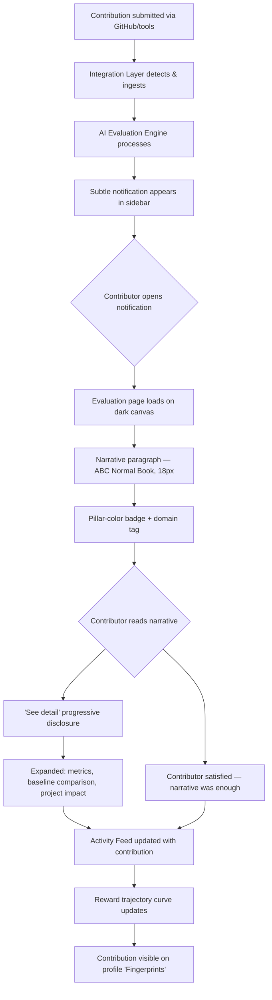
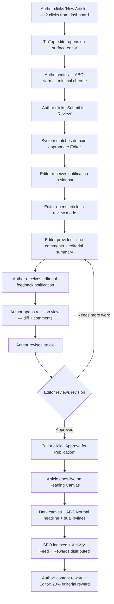
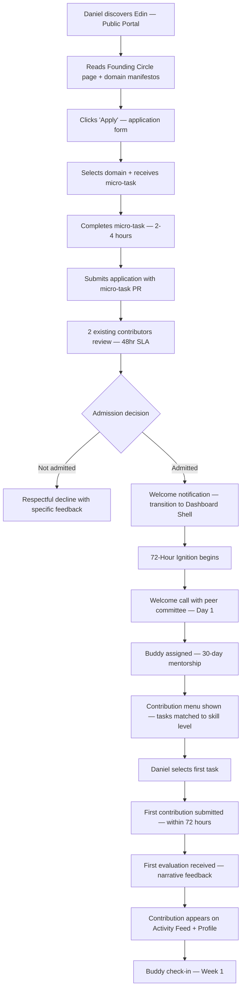
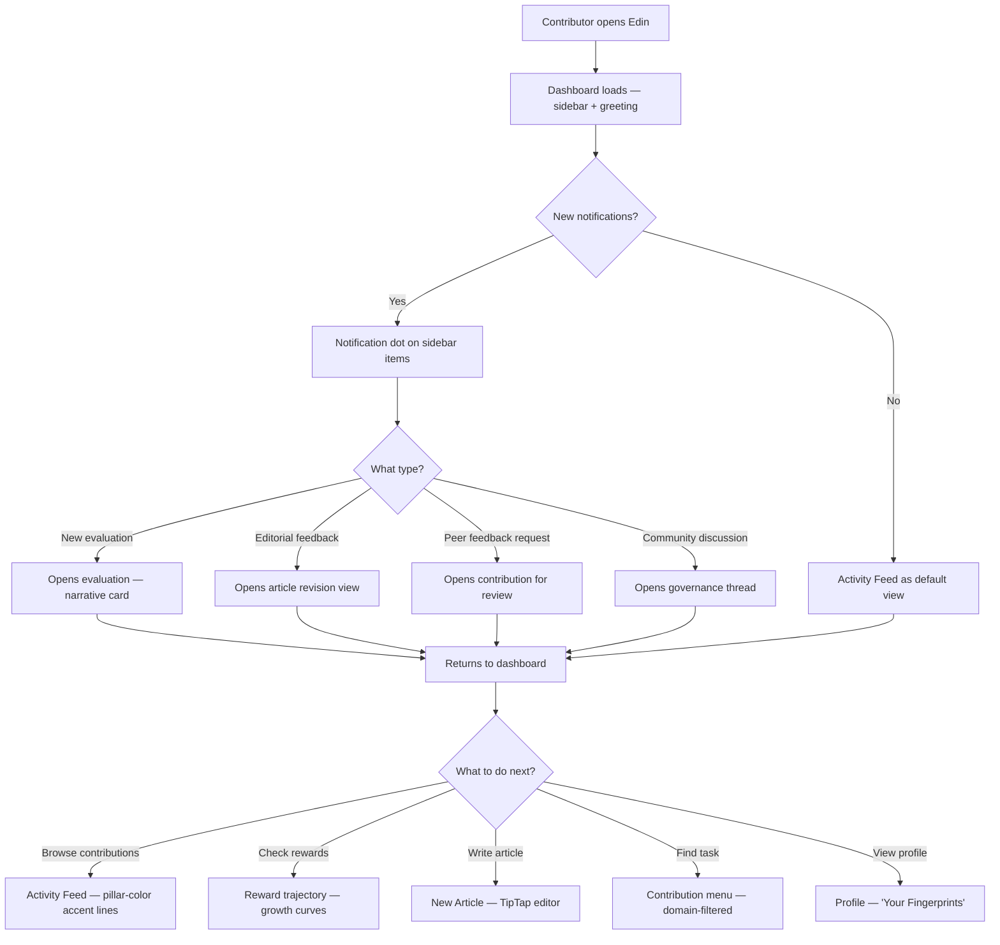
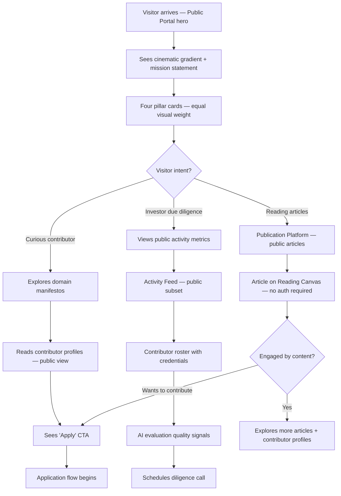

# UX Design Specification Edin

**Author:** Fabrice
**Date:** 2026-03-13

---

## Executive Summary

### Project Vision

Edin is a curated contributor platform for the Rose decentralized finance ecosystem that organizes, evaluates, rewards, and publishes collaborative development across four domains: Technology, Finance, Impact, and Governance. The platform operates through six functional pillars — Integration Layer, Web Portal, AI Evaluation Engine, Multi-Scale Reward System, Governance Layer, and Publication Platform — serving a community of domain experts who contribute through existing tools while Edin provides the intelligence, reward, and publishing layers.

The Publication Platform — a modern think tank and community-driven publication — is core to the community growth strategy. Every piece of content has an Author and an Editor (who receives 20% of the author's reward), creating a structured incentive for editorial mentorship. The publication aims to rival the quality and authority of established publications like The Economist, produced entirely by a decentralized community of domain experts.

The visual identity draws from the **ROSE brand design language** — dark cinematic backgrounds, vivid orange accents, the ABC Normal typeface family, and pillar-coded color shields — adapted for a functional web application. The Edin logo remains the primary brand mark across the platform; the ROSE shield/rose crest appears only in Rose-specific content sections (About Rose, Rose context pages). The ROSE aesthetic (dark palettes, bold typography, editorial drama, pillar color system) permeates the entire product as the design foundation.

The UX must embody the founder's design vision: **beautiful, calming, insightful visuals** that translate complex information (AI evaluations, scaling-law rewards, contribution data) into experiences that feel like reading a beautifully designed publication rather than monitoring a dashboard. Multi-cultural visual language reflects the platform's universal roots (Edin — Sumerian for "fertile plain") and its global, multi-domain community.

### Target Users

**Primary Contributors (4 domain personas):**

- **Lena (Technology)** — Senior developer, values craft over quantity. Needs AI evaluation that recognizes quality work. Tech-savvy, uses GitHub daily. Wants to see the _craft_ of her work reflected, not just commit counts.
- **Amir (Finance)** — Financial engineer, non-developer. Needs equal domain standing alongside code contributions. Comfortable with data-rich interfaces but not developer tools. Contributes through documents and analyses.
- **Sofia (Impact)** — Impact analyst, values structural equality. Needs evidence that Impact is a real pillar. Comfortable with professional tools, expects institutional-quality interfaces.
- **Yuki (Governance)** — Governance specialist, deeply skeptical of performative decentralization. Needs transparent, traceable governance records. Detail-oriented, expects precision.

**Publication Personas:**

- **Clara (Author)** — Contributor who writes insightful articles. Needs a professional authoring experience with structured editorial support. Values seeing her ideas shaped and published to a quality standard.
- **Marcus (Editor)** — Experienced contributor who curates and shapes others' work. Needs editorial tools that feel professional and rewarding. Values visible editorial identity and mentorship.

**Operational Personas:**

- **Daniel (Applicant)** — Mid-level developer discovering Edin. Needs a clear, welcoming path from discovery to first contribution within 72 hours. Less experienced, needs guidance without condescension.
- **Marie (Admin)** — Platform operations lead. Needs efficient tools for admissions, metrics, and community health. Values operational clarity without information overload.
- **Henrik (Investor)** — Due diligence evaluator. Accesses public portal only (no auth). Needs transparent traction evidence — contributor quality, evaluation data, community health — presented with the authority and design quality of a professional investor relations page.

### Key Design Challenges

1. **Translating ROSE's cinematic visual language into a functional web app** — The ROSE deck uses dramatic dark gradients, bold typography, and editorial drama. The challenge is adapting this mood for daily-use interfaces (dashboards, article editing, admin) where readability and usability must coexist with visual drama. Dark mode is the deck's native state — the platform designs dark-first with light mode as a considered variant.

2. **Two brand identities, one coherent product** — Edin has its own logo and identity, while ROSE has a distinct visual language (shield crest, pillar-colored shields, orange accent). The ROSE logo and shield iconography appears only in Rose-specific sections, but the ROSE aesthetic (dark palettes, ABC Normal typography, orange/pink/cyan/green accents) permeates the whole product. The line between "Edin brand" and "ROSE aesthetic influence" must be intentional.

3. **Calming complexity within dark UI** — Dark interfaces can feel oppressive or intense if not handled carefully. The founder wants calming, insightful visuals. ROSE's deck achieves this through generous space and editorial pacing. Translating that into data-rich screens (evaluations, rewards, contribution feeds) without triggering dashboard anxiety is the central tension.

4. **Publication reading experience on a dark platform** — Long-form article reading is traditionally optimized on light backgrounds. The Publication Platform must deliver Economist-quality reading comfort — through light article containers within the dark shell, a dedicated light reading mode, or carefully tuned dark reading typography.

5. **Pillar color system from the deck** — ROSE uses orange (engine/financial), green (impact/sustainability), cyan (governance), gold (platform/community). These map naturally to Edin's four domains but need refinement for accessibility (contrast on dark backgrounds) and for use as functional UI colors beyond decorative accents.

### Design Opportunities

1. **The ROSE deck's cinematic visual language is the differentiator** — No contributor platform looks like this. The dark, editorial, magazine-feel aesthetic immediately signals "this is not another GitHub clone." If Edin inherits this mood, it stands alone visually in the Web3/open-source space.

2. **ABC Normal as a signature typeface** — The font family (7 weights) gives Edin a custom typographic voice. Bold condensed uppercase for impact headlines, lighter weights for body. This alone creates visual recognition and editorial authority that competitors using system fonts cannot match.

3. **Pillar-colored shields as visual identity system** — Each domain getting its own colored shield variant creates an instant visual language for navigation, contribution cards, profile badges, and article categorization. Elegant, compact, and directly inherited from the ROSE deck.

4. **Dark mode as default, not an afterthought** — Most platforms add dark mode later. Edin designs dark-first (matching the ROSE aesthetic), so the entire color system, contrast ratios, and visual hierarchy are optimized for it from day one. Light mode becomes the variant.

## Core User Experience

### Defining Experience

**"See how your work was truly understood — and share that understanding with the world."**

Edin's core experience operates through two intertwined loops that share a common emotional center: the feeling that your contribution was genuinely comprehended and elevated.

**The Contribution Loop:** A contributor works with their familiar tools. Edin ingests the output. The AI Evaluation Engine analyzes the work and produces a transparent breakdown — not a score on a screen, but an insightful narrative about what the contribution achieved, what quality it demonstrated, and how it advanced the ecosystem. The contributor reads the evaluation and thinks: "It understood the craft." This understanding motivates the next contribution.

**The Publication Loop:** A contributor has an insight worth sharing. They write a draft. An Editor — a fellow contributor who understands the domain — shapes the piece through structured editorial feedback. The article transforms from rough expertise into polished, publication-quality prose. It goes live on the Publication Platform, beautifully typeset on a dark, cinematic canvas, and reaches readers beyond the Edin community. The author sees their ideas taken seriously, shaped with care, and read by people who matter. This visibility motivates the next article.

Both loops converge on the same moment: **understanding made visible** — rendered in the ROSE visual language of dark, spacious, editorially-paced design. The AI evaluation makes the quality of technical work visible. The editorial process makes the quality of intellectual insight visible. Edin's UX must make both forms of "being understood" feel calming, insightful, and beautiful — never anxious or metrics-driven.

### Platform Strategy

**Primary platform:** Web application (responsive), dark-first design

- **Public Portal + Publication Platform:** Server-side rendered for SEO. Article reading experience optimized for all devices — mobile reading is a primary use case. Typography-first design approach with ABC Normal as the signature typeface. Dark backgrounds with carefully tuned reading containers for long-form comfort.
- **Contributor Dashboard:** Single-page application for responsive interactions. Desktop-first design with full mobile support. Real-time updates for Activity Feed and evaluation notifications. Dark UI throughout.
- **Admin Dashboard:** Desktop-optimized. Dark theme. Complex data tables and operational views with the ROSE muted palette. Mobile access for monitoring, not primary workflow.
- **Authoring/Editorial:** Desktop-first for writing and editing. Clean, focused editor — possibly with a lighter writing surface for extended composition comfort. Mobile for reviewing editorial feedback and managing workflow status.

**No offline requirement.** All interactions require network access for real-time data (evaluations, editorial feedback, contribution ingestion).

**No native app.** The web experience must be excellent enough that native wrappers add no value. Article reading experience should match native reading apps in typographic quality.

### Effortless Interactions

**What must feel completely natural:**

- **Contributing:** Zero workflow change. Work in GitHub, Google Docs, whatever tools you use. Edin ingests automatically. The contributor never "uploads to Edin" — their work appears because Edin is watching their tools, not the other way around.
- **Reading an evaluation:** The evaluation breakdown should read like a short editorial review of your work, not a grade report. No cognitive load to parse scores — the insight comes through narrative and gentle visual hierarchy on dark backgrounds. The ROSE aesthetic's generous space and bold-then-light typography rhythm makes dense evaluation data breathable.
- **Reading a published article:** Opening an article should feel like opening a beautifully designed digital magazine — immediate immersion in well-typeset prose against the dark cinematic canvas, ABC Normal headings, generous margins. No platform chrome competing for attention. The content is the experience.
- **Starting as an Author:** The path from "I have an idea" to "I'm writing a draft" should be 2-3 clicks. The authoring interface should feel like a focused writing tool (Notion, Medium editor), not a form with fields.

**What should happen automatically:**

- Contribution ingestion from connected tools (no manual submission for code/docs)
- Editor assignment when an article is submitted (matched by domain expertise)
- Peer feedback assignment for new contributions
- Activity Feed updates as contributions and publications flow in
- Reward calculations and trajectory updates

### Critical Success Moments

1. **"The AI understood my craft"** (Lena moment) — When a contributor sees their evaluation breakdown and realizes the system recognized the quality and subtlety of their work. The evaluation reads like a thoughtful review on a dark, spacious page — narrative first, scores secondary. If this moment fails (evaluation feels mechanical or unfair), the platform loses its core differentiator.

2. **"My article looks like it belongs in a real publication"** (Clara moment) — When an author sees their published article on the dark Publication Platform for the first time — ABC Normal typography, editorial layout, author and editor bylines displayed with care. If this moment fails (article looks like a blog post or wiki entry), the "modern Economist" vision collapses.

3. **"I belong here"** (Daniel moment) — When a new contributor completes the 72-Hour Ignition and sees their first contribution on the Activity Feed alongside work from senior contributors, presented with equal visual dignity on the dark-themed feed. If this moment fails (onboarding feels bureaucratic or isolating), retention drops.

4. **"My domain has real weight"** (Amir/Sofia moment) — When a non-developer contributor sees their work displayed with pillar-colored accents (green for Impact, cyan for Governance, gold for Finance) at equal visual prominence alongside orange-accented Technology work. If this moment fails (the platform feels code-centric despite its four-pillar structure), multi-domain equality fails.

5. **"This community is real"** (Henrik moment) — When an investor accesses the public portal and sees a living, high-quality publication alongside contributor profiles and transparent metrics on a dark, authoritative canvas that feels institutional, not startup-y. If this moment fails (the public page looks like a landing page with vanity metrics), investor credibility collapses.

### Experience Principles

1. **Insight before numbers** — Never show a metric without context. Every data point should tell a story. An evaluation score is meaningless; an evaluation narrative that explains what the AI recognized about the contributor's craft is transformative. Lead with the insight, make the number available on demand. On dark backgrounds, numbers recede and narratives advance.

2. **The page breathes** — Generous whitespace, deliberate pacing, content that reveals itself as you need it. No information overload. The ROSE deck's cinematic spacing becomes the design standard. The design should feel like a curated exhibition, not a control panel. This directly embodies the founder's "calming, not nervous" directive.

3. **Equal by design, distinct by character** — All four domains share the same visual weight, layout patterns, and reward pathways. But each domain has its own pillar color (orange for Technology, green for Impact, cyan for Governance, gold for Finance) that gives it identity without hierarchy. Technology doesn't look more important than Impact — they look different but equally dignified.

4. **Publication quality everywhere** — The typographic and layout standards of the Publication Platform should influence the entire design system. Contributor profiles, evaluation breakdowns, and even admin dashboards should feel editorially designed — as if every page were composed with ABC Normal and the care of a magazine layout.

5. **The garden grows** — The platform should feel alive and growing, not static and administrative. Activity Feeds, contribution timelines, reward trajectories, and publication archives should evoke the sense of a living ecosystem — a garden being cultivated by many hands. On dark backgrounds, growth visualizations glow with the warmth of pillar colors. Organic metaphors over mechanical ones.

6. **Warmth through substance** — Emotional warmth comes from treating contributors with intellectual respect, not from cheerful UI copy or gamification badges. The warmth of Edin is the warmth of being taken seriously — of having your work evaluated with care, your articles edited with attention, your domain treated with structural equality.

## Desired Emotional Response

### Primary Emotional Goals

**The Edin Emotional Signature: Calm Confidence on a Dark Canvas**

Edin should make users feel the way you feel when reading a beautifully designed long-form article by someone who truly understands their subject — calm, engaged, intellectually stimulated, and confident that you're in the hands of people who care about quality. The ROSE deck's cinematic dark aesthetic amplifies this: the dark backgrounds create focus, the vivid accents create drama, and the generous space creates breathing room. Not the anxiety of a performance dashboard. Not the dopamine hit of a social feed. The sustained, quiet satisfaction of being in a place where serious work is done with care.

Three primary emotional states:

1. **Intellectual respect** — "This platform treats me as a serious professional." Every interaction — from the evaluation breakdown to the publication layout to the admin dashboard — communicates that the people behind Edin respect the intelligence of their users. ABC Normal's typographic authority sets the tone. No condescension, no gamification tricks, no infantilizing onboarding wizards. The design assumes competence and rewards attention.

2. **Calm clarity** — "I can see everything I need without feeling overwhelmed." Complex information (AI evaluations, reward trajectories, editorial feedback, community health) is presented through progressive disclosure: the insight first, the detail on demand. Dark backgrounds naturally reduce visual noise. Pillar colors guide the eye to what matters. Contributors should feel the opposite of dashboard anxiety.

3. **Belonging through contribution** — "My work matters here, and I can see the evidence." The platform makes the impact of each contributor's work visible — not through vanity metrics or leaderboards, but through the narrative quality of evaluations, the editorial care given to publications, and the equal visual dignity afforded to every domain via its pillar color.

### Emotional Journey Mapping

| Stage                                     | Desired Feeling                                                      | Design Implication                                                                                                                                                                                                         |
| ----------------------------------------- | -------------------------------------------------------------------- | -------------------------------------------------------------------------------------------------------------------------------------------------------------------------------------------------------------------------- |
| **Discovery** (Henrik, Daniel)            | Quiet authority — "These people are serious"                         | Public portal and Publication Platform project institutional quality on dark canvas. Published articles demonstrate intellectual depth. ABC Normal headings command attention. Contributor roster shows real professionals |
| **Application** (Daniel)                  | Respectful challenge — "They care who joins"                         | Micro-task application feels like an invitation to demonstrate competence, not gatekeeping. Dark UI with warm orange accents guides the path                                                                               |
| **Admission** (Daniel)                    | Welcome without ceremony — "I'm part of something real"              | 72-Hour Ignition is warm but substantive. No confetti animations. Warmth comes from a real person (buddy) and a meaningful first task                                                                                      |
| **First contribution** (All)              | Anticipatory calm — "I'm curious to see how this is received"        | Clear status ("evaluation in progress") without anxious waiting. No countdown timers or urgency signals. Dark background with subtle status indicators                                                                     |
| **Seeing evaluation** (Lena, Amir, Sofia) | Recognition of craft — "It understood what I did"                    | Evaluation reads like a thoughtful review, not a report card. Narrative first, scores secondary. Generous whitespace on dark canvas. The contributor feels _seen_, not graded                                              |
| **Publishing an article** (Clara)         | Creative pride — "This is the best version of my thinking"           | Published article looks beautiful on the dark Publication Platform. Author/editor bylines displayed with the care of a quality publication's credit line                                                                   |
| **Editing an article** (Marcus)           | Mentorship satisfaction — "I helped shape something meaningful"      | Editorial interface shows the arc from draft to publication. Editor sees impact as narrative, not tracked changes                                                                                                          |
| **Returning daily** (All)                 | Steady engagement — "There's always something worth seeing"          | Activity Feed and Publication stream are curated, not noisy. Quality over quantity. Each item earns its place on the dark page                                                                                             |
| **Viewing rewards** (All)                 | Patient confidence — "My sustained engagement is building something" | Reward trajectory visualizations show growth curves, not point totals. Organic growth metaphors glow with pillar colors against dark backgrounds                                                                           |
| **Something goes wrong** (All)            | Supported resilience — "The system has my back"                      | Errors communicated with clarity and empathy. "Your contribution is being retried" not "Ingestion failed." The system takes responsibility                                                                                 |

### Micro-Emotions

**Critical emotional states to cultivate:**

- **Trust over skepticism** — Yuki (the governance skeptic) is the design litmus test. If the platform earns Yuki's trust through transparent governance records and credible decentralization milestones, it earns everyone's trust. Design implication: every claim backed by visible evidence. No marketing language in the authenticated experience.

- **Confidence over confusion** — Amir (the non-developer) is the accessibility litmus test. If Amir can navigate contribution, evaluation, and reward flows without developer-specific knowledge, the platform is truly multi-domain. Design implication: no jargon-dependent interfaces, no code-centric metaphors in shared spaces.

- **Accomplishment over frustration** — Daniel (the applicant) is the onboarding litmus test. If Daniel feels accomplished within 72 hours rather than overwhelmed, the 72-Hour Ignition works. Design implication: guided but not patronizing, structured but not rigid.

- **Belonging over isolation** — Sofia (the impact analyst) is the equality litmus test. If Sofia's impact assessment has the same visual dignity and presence as Lena's code refactoring — same card layout, equal pillar-color prominence — multi-domain equality is real.

- **Creative pride over performance anxiety** — Clara (the author) is the publication litmus test. If Clara feels pride when she sees her published article on the dark canvas rather than performance anxiety about metrics, the Publication Platform has the right tenor.

**Emotions to actively prevent:**

- **Dashboard anxiety** — The feeling of being monitored by numbers. Prevented by: narrative-first evaluation, progressive disclosure, generous whitespace, no red/green scoring. Dark backgrounds help — they recede rather than glare.
- **Imposter syndrome** — The feeling of not belonging. Prevented by: welcoming onboarding, buddy system, contributions displayed alongside (not below) senior work.
- **Competitive tension** — The feeling that others' success diminishes yours. Prevented by: no leaderboards, no ranking, no comparative metrics. Every contributor's journey is individual.
- **Publication pressure** — The feeling that you must publish or lose standing. Prevented by: publication is opportunity, not requirement. No "days since last article" counters.

### Design Implications

| Emotional Goal                 | UX Approach                                                                                                                                                                                                                                    |
| ------------------------------ | ---------------------------------------------------------------------------------------------------------------------------------------------------------------------------------------------------------------------------------------------- |
| Intellectual respect           | Typography-forward design with ABC Normal. Editorial weight for headings. Long-form readable content. No emoji or casual iconography in professional spaces. Contributor profiles that look like author biographies, not social media cards    |
| Calm clarity                   | Progressive disclosure: summary → detail on click/expand. Generous whitespace (minimum 24px between content blocks). Dark muted palette with warm pillar accents. No animation for animation's sake — motion only to communicate state changes |
| Belonging through contribution | Activity Feed shows contributions chronologically without ranking. Pillar-color accents give identity without hierarchy. "Your Fingerprints" section on contributor profile shows where their work has had impact                              |
| Recognition of craft           | Evaluation breakdowns open with a narrative paragraph ("Your refactoring reduced complexity by...") before showing any scores. Scores as subtle indicators on dark backgrounds, not bold numbers                                               |
| Creative pride                 | Published articles with beautiful ABC Normal typography, generous margins, author/editor credits like bylines. Article pages feel like a standalone publication on the dark canvas, not a platform subpage                                     |
| Patient confidence             | Reward trajectory shown as growth curve visualization with organic, garden-inspired visual language. Pillar colors glow against dark backgrounds. "Your garden is growing" not "Your score is 847"                                             |

### Emotional Design Principles

1. **Evidence before claims** — Never tell users to feel something; show them evidence that creates the feeling naturally. Don't say "your work is valued" — show them an evaluation that demonstrates deep understanding. Don't say "this is a quality publication" — design article pages so beautifully on the dark canvas that quality is self-evident.

2. **Dignity in every interaction** — Every touchpoint treats the user as an intelligent professional. Error messages explain what happened and what's being done. Empty states explain what will appear and why. Loading states communicate progress, not anxiety. No cheerful copy masking system limitations.

3. **Emotional safety for vulnerability** — Contributing work and publishing articles are acts of vulnerability. The platform creates emotional safety through predictable processes, clear expectations, and private feedback before public visibility. An evaluation is shared with the contributor first, never publicly without consent. Editorial feedback is private between author and editor.

4. **Warmth through substance** — The emotional warmth of Edin comes not from bright colors or casual tone — it comes from the substance of what the platform delivers: evaluations that show genuine understanding, editorial feedback that genuinely improves work, rewards that genuinely compound. Substance is warmth. The dark aesthetic paradoxically amplifies this — warmth glows brighter against a dark background.

5. **Anticipatory reassurance** — At every point where a user might feel uncertain ("Did my contribution upload?" "When will I hear back?" "Is my article being reviewed?"), provide proactive status information before they need to ask. Calm confidence requires knowing where things stand without having to chase information.

## UX Pattern Analysis & Inspiration

### Inspiring Products Analysis

**1. The Economist (Digital Edition) — Editorial Authority & Reading Experience**

- **Core UX strength:** Transforms dense, complex global analysis into calm, authoritative reading experiences. The reader never feels overwhelmed despite depth. Typography, whitespace, and visual hierarchy do the heavy lifting — the design says "this is serious" without saying "this is stressful."
- **Navigation & information hierarchy:** Section-based (Finance, Science, Culture) with equal visual weight — no section dominates. Article pages strip away navigation chrome, creating an immersive reading tunnel. This directly maps to Edin's four-domain equality requirement.
- **Visual design choices:** Serif typography for authority. Red accent used sparingly for brand identity, not for alerts. Illustrations are editorial (commissioned, conceptual) rather than stock or decorative. Dense information presented through curated editorial judgment, not raw data dumps.
- **What keeps users returning:** The feeling of being well-informed without being overwhelmed. Intellectual stimulation wrapped in visual calm.
- **Relevance to Edin:** The Publication Platform's reading experience should aim for this emotional register — adapted to dark backgrounds with ABC Normal replacing their serif system.

**2. Linear — Dark-First Professional Tool Design**

- **Core UX strength:** Proves that dark-first design works for daily professional tools. Fast, minimal, typography-driven. Makes project management feel calm rather than overwhelming. The dark palette creates focus; color accents are functional, not decorative.
- **Navigation & information hierarchy:** Minimal left sidebar, keyboard-first navigation, zero unnecessary chrome. Information density is high but never cluttered. Instant transitions give the feeling of a native app.
- **Visual design choices:** Dark backgrounds with restrained color accents. Animation is purposeful and subtle (state transitions, not decoration). Typography is clean and hierarchical.
- **Relevance to Edin:** The closest existing model to what Edin's dark-first Contributor Dashboard should feel like. Proves dark UI can be calming, not oppressive, for all-day professional use.

**3. Stripe Dashboard — Calm Complexity in Financial Data**

- **Core UX strength:** Makes extraordinarily complex financial/technical information feel manageable and elegant. Progressive disclosure is masterful — summary views expand into detail without context switching.
- **Navigation & information hierarchy:** Left sidebar with clear grouping. Content area uses generous whitespace and consistent typography hierarchy. Data visualizations are minimal and purposeful — small charts that tell one story clearly.
- **Visual design choices:** Neutral palette with strategic color accents. Typography is clean and spacious. Gradients and subtle depth.
- **Relevance to Edin:** The evaluation breakdown and reward trajectory views should learn from Stripe's ability to present complex data with calm clarity — translated into Edin's dark palette.

**4. Are.na — Community Curation & Equal Dignity**

- **Core UX strength:** A platform where visual art, research, code, essays, and links all coexist with equal visual weight. No content type dominates. The design treats every contribution with the same quiet respect, regardless of format. The closest existing model to Edin's multi-domain equality aspiration.
- **Visual design choices:** Monochromatic, grid-based, deliberately minimal. No gamification, no follower counts, no trending algorithms. The anti-social-media aesthetic.
- **Relevance to Edin:** Demonstrates that diverse contribution types (code, documents, analyses, governance proposals) can have equal visual dignity. Its anti-gamification philosophy aligns with Edin's "no leaderboards, no competitive tension" principle.

**5. Notion — Authoring Experience & Structured Content**

- **Core UX strength:** Makes content creation effortless through block-based editing with slash commands. Writing feels like thinking, not form-filling. The transition from blank page to structured document is smooth and never intimidating.
- **Visual design choices:** Clean, minimal chrome. Content area dominates. Sidebar collapses to maximize writing space. Typography optimized for readability during both editing and reading.
- **Relevance to Edin:** The authoring/editorial interface for the Publication Platform should feel this natural. The transition from blank page to structured article should be effortless.

**6. The ROSE Deck — Primary Visual DNA**

- **Core UX strength:** A bespoke design language no web platform currently embodies. Dark charcoal gradients, vivid orange/pink/cyan/green pillar accents, ABC Normal typography, shield iconography, cinematic pacing. Not just inspiration — the actual design DNA.
- **What it teaches:** Bold headlines in ABC Normal Black/Bold set the drama. Blush pink on dark backgrounds creates readable-yet-striking body headings. Pillar colors as identity markers. Generous negative space as a design tool. Illustrations as editorial art, not decoration.
- **Design validation test:** Every design decision should be validated against: "Does this feel like it belongs in the ROSE deck?"

### Transferable UX Patterns

**Navigation Patterns:**

- Linear's keyboard-first, minimal left sidebar → Edin's Contributor Dashboard navigation
- The Economist's section-based equality → Edin's four-domain navigation with equal pillar-color weight
- Stripe's progressive disclosure in sidebar → Edin's admin tools and nested views

**Interaction Patterns:**

- Notion's slash-command authoring → Edin's Publication Platform editor
- Linear's instant transitions and keyboard shortcuts → Edin's power-user flows for experienced contributors
- Stripe's expandable detail cards → Edin's evaluation breakdowns (narrative summary → full detail)

**Visual Patterns:**

- ROSE deck's dark gradient + vivid accent system → Edin's entire color foundation
- Linear's proof that dark-first works for daily tools → Edin's dark-first confidence
- The Economist's typographic authority → Publication Platform reading experience (adapted with ABC Normal)
- Are.na's content-type equality → Edin's contribution card system with equal pillar-color dignity across domains

### Anti-Patterns to Avoid

- **GitHub's code-centric visual hierarchy** — Makes non-code contributions feel second-class. Edin must give equal visual weight to all four domains.
- **Gitcoin's gamification layer** — Leaderboards, badges, and popularity metrics create competitive anxiety. Contradicts "calm confidence."
- **Discord's visual noise** — Dense, noisy, overwhelming. The opposite of "the page breathes."
- **Generic SaaS dashboards** — Metric-heavy, chart-dense, anxiety-producing. Edin should never feel like a monitoring tool.
- **Medium's degraded reading experience** — Pop-ups, sign-up walls, recommended content interrupting reading flow. Publication Platform must be pure immersion.

### Design Inspiration Strategy

**What to Adopt:**

- ROSE deck's dark gradient palette, ABC Normal typography, pillar color system — as the foundation, not merely inspiration
- Linear's dark-first UI patterns for contributor dashboard
- The Economist's editorial reading experience principles (adapted to dark)
- Notion's block-based authoring interaction model

**What to Adapt:**

- Stripe's progressive disclosure — translated from light to dark palette, adapted for evaluation narratives rather than financial data
- Are.na's equal-dignity grid — expanded with pillar-color identity for Edin's four domains
- The ROSE deck's cinematic slide layouts — distilled into web-native component patterns (presentation design adapted to interactive design)

**What to Avoid:**

- Any gamification elements (badges, leaderboards, streaks, points)
- Code-centric visual metaphors in shared spaces
- Light-mode-first design that treats dark as an afterthought
- Dense data dashboards that trigger monitoring anxiety
- Social-media patterns (follower counts, trending, likes)

## Design System Foundation

### Design System Choice

**Custom Design System on Tailwind CSS v4 + Radix UI Primitives**, built into the existing `@edin/ui` shared monorepo package.

The existing tech stack (Next.js 16, React 19, Tailwind CSS v4, Radix UI, TipTap, Recharts, `@edin/ui` package, Turbo monorepo) has already established the foundation. The design system builds on this by encoding the ROSE visual language into Tailwind design tokens and wrapping Radix primitives with ROSE-themed styling.

### Rationale for Selection

1. **Full visual control** — Tailwind's utility classes + custom theme give complete control over the ROSE aesthetic. No fighting framework defaults. Dark gradients, ABC Normal typography, pillar colors — all defined as design tokens in the Tailwind v4 `@theme` configuration.

2. **Accessible primitives** — Radix UI provides unstyled, accessible behavior (keyboard navigation, focus management, ARIA) while we control 100% of the visual layer. No overriding Material Design or Ant defaults to reach the ROSE aesthetic.

3. **ABC Normal as first-class typography** — Tailwind's font configuration makes custom typeface integration straightforward. ABC Normal's 7 weights (Light, Book, Neutral, Medium, Bold, Black, Super) defined as the primary font family with full weight scale mapping.

4. **Dark-first via Tailwind** — Tailwind v4's CSS-first configuration makes dark-as-default natural. The dark palette is the base; light mode is the variant via class toggle or media query.

5. **The `@edin/ui` package exists** — The shared component library is architecturally ready to receive ROSE-themed components. Monorepo structure (`apps/web`, `apps/api`, `packages/ui`) supports this pattern.

### Implementation Approach

| Layer                    | Tool                                      | Purpose                                                                                                       |
| ------------------------ | ----------------------------------------- | ------------------------------------------------------------------------------------------------------------- |
| **Design tokens**        | Tailwind CSS v4 `@theme`                  | Colors, typography, spacing, shadows — ROSE palette as CSS custom properties                                  |
| **Component primitives** | Radix UI                                  | Accessible behavior (dialog, tabs, dropdown, accordion, popover, tooltip, switch, select, scroll-area, toast) |
| **Component styling**    | Tailwind utilities + `@edin/ui`           | ROSE-themed visual layer on Radix primitives                                                                  |
| **Rich text editor**     | TipTap (already installed)                | Publication Platform authoring — styled to ROSE spec with extensions for code blocks, images, links           |
| **Data visualization**   | Recharts (already installed)              | Evaluation charts, reward trajectories — themed with pillar colors on dark backgrounds                        |
| **Layout system**        | Tailwind CSS                              | Responsive grid, spacing, breakpoints                                                                         |
| **Form handling**        | React Hook Form + Zod (already installed) | Validated forms with ROSE-styled inputs                                                                       |

### Customization Strategy

**Design Tokens (Tailwind v4 `@theme`):**

```
Surface colors (dark gradient scale):
  --color-surface-base: charcoal (#1A1A1A range)
  --color-surface-elevated: slightly lighter charcoal
  --color-surface-overlay: modal/dialog backgrounds
  --color-surface-reading: optimized for long-form text

Accent colors (from ROSE deck):
  --color-accent-primary: ROSE vivid orange (~#FF5500)
  --color-accent-secondary: Blush pink (~#E8C8C8)

Pillar colors:
  --color-pillar-tech: Orange (Technology & Development)
  --color-pillar-impact: Green (Impact & Sustainability)
  --color-pillar-governance: Cyan (Consciousness & Governance)
  --color-pillar-finance: Gold (Finance & Financial Engineering)

Text colors:
  --color-text-primary: Light/white for body on dark
  --color-text-secondary: Muted gray for secondary content
  --color-text-heading: Blush pink for headings on dark (from ROSE deck)
  --color-text-accent: Orange for emphasized text

Typography:
  --font-display: ABC Normal Bold/Black (headlines, impact text)
  --font-body: ABC Normal Book/Light (body text, UI labels)
  --font-ui: ABC Normal Medium/Neutral (buttons, navigation)
  --font-mono: Monospace fallback (code contexts only)
```

**Component Library (`@edin/ui`) Extension:**

- Wrap existing Radix primitives with ROSE-themed styling classes
- Create Edin-specific components:
  - `ContributionCard` — Domain-aware card with pillar-color accent
  - `EvaluationBreakdown` — Narrative-first evaluation display with progressive disclosure
  - `PillarBadge` — Color-coded domain identifier
  - `ArticleLayout` — Publication-quality reading container
  - `RewardTrajectory` — Organic growth visualization
  - `ActivityFeedItem` — Chronological contribution display with equal domain weight
  - `ContributorProfile` — Author-biography-style profile card
- All components dark-first with optional light variant

**TipTap Customization:**

- Custom theme matching ROSE editor aesthetic
- Publication-quality rendering in both edit and read mode
- ABC Normal typography throughout editor
- Dark editor surface with comfortable contrast for extended writing

**Recharts Theming:**

- Custom color scales using pillar colors
- Dark background chart containers
- Organic, growth-oriented visualization styles (curves over bars)
- Minimal axis/grid lines — data speaks through shape, not gridlines

## Defining Core Experience

### Defining Experience #1: "Reading Your Evaluation"

**The one-liner:** "Contribute your work anywhere — then see how the AI truly understood your craft."

This is the moment that differentiates Edin from every contributor platform. The contributor works in their familiar tools, Edin ingests the output, and then presents an **evaluation narrative** — not a score, but a story about what the contribution achieved.

**Mechanics:**

1. **Initiation:** Automatic. The contributor doesn't trigger evaluation — it happens when Edin detects new contributions via connected tools (GitHub PR merged, document submitted, etc.). A subtle notification appears: "New evaluation ready."

2. **Interaction:** The contributor opens their evaluation. The page opens on a dark canvas with generous whitespace. At the top: a **narrative paragraph** in ABC Normal Book — "Your architectural refactoring eliminated the circular dependency in the auth module, reducing complexity metrics by 34% and enabling the team to independently deploy the auth service. This is foundational work that compounds." Below the narrative: subtle quality indicators (not scores — visual markers), domain tag (pillar color badge), and a "See detail" progressive disclosure.

3. **Feedback:** The narrative itself IS the feedback. The contributor reads it and thinks: "It understood the craft." The detail level (expandable) shows specific metrics, comparison to baseline, and how the contribution connects to project-level objectives.

4. **Completion:** The evaluation is acknowledged. The contribution appears on the Activity Feed. Reward trajectory updates show the compounding effect. No action required from the contributor — understanding was the reward.

### Defining Experience #2: "Seeing Your Article Published"

**The one-liner:** "Write your insight, have it shaped by an editor, see it published beautifully on a dark, editorial canvas."

This is the Publication Platform's defining moment — when an author sees their article live and it looks like it belongs in a quality publication.

**Mechanics:**

1. **Initiation:** Author clicks "New Article" (2-3 clicks from anywhere in the dashboard). TipTap editor opens — a clean, focused writing surface. ABC Normal typography. Minimal chrome. Feels like Notion, not a CMS form.

2. **Interaction:** Author writes. Submits for editorial review. An Editor is assigned (matched by domain). Editor provides structured feedback via inline comments and an editorial summary. Author revises. Editor approves.

3. **Feedback:** On publication, the article goes live on the Publication Platform. Dark canvas. ABC Normal headline in bold. Author byline and Editor credit displayed with the care of a quality publication. Domain pillar-color accent. Beautiful layout. The author sees it and thinks: "This is the best version of my thinking."

4. **Completion:** Article is live, indexed for SEO, visible on the Activity Feed. Author and Editor both receive rewards. The article becomes part of Edin's public face — proof that this community produces serious intellectual work.

### User Mental Model

**For evaluations:** Contributors bring the mental model of code review — someone (or something) reads your work and tells you what they think. The key difference: Edin's AI evaluation should feel **more insightful than a typical code review**, not less. It should notice things that human reviewers might miss (architectural impact, maintainability patterns, cross-project effects). Contributors from non-code domains (Amir, Sofia, Yuki) bring the mental model of a **professional performance review** — detailed, substantive, respectful.

**For publication:** Authors bring the mental model of Medium or Substack — write, publish, be read. The key difference: the **editorial layer** elevates this beyond self-publishing. The Editor role transforms the experience from "I posted something" to "Something I wrote was shaped and published to a standard." This is the mental model of being published in a journal, not posting on a blog.

### Success Criteria

| Criteria                                      | Measure                                                                               | Why It Matters                                                                                  |
| --------------------------------------------- | ------------------------------------------------------------------------------------- | ----------------------------------------------------------------------------------------------- |
| Evaluation reads like insight, not a grade    | >70% of contributors rate evaluation as "fair" or "insightful"                        | Core differentiator — if evaluations feel mechanical, the platform is just another scoring tool |
| Evaluation loads within the contribution loop | <15 minutes from contribution to evaluation visibility                                | Near-real-time feedback maintains the contribution loop momentum                                |
| Article publication feels transformative      | >80% of first-time authors say the published article "exceeded expectations" visually | The Clara moment — if the article looks like a blog post, the Economist vision fails            |
| Editor feedback improves the work             | >60% of authors say editorial feedback "meaningfully improved" their article          | The mentorship flywheel depends on editorial quality                                            |
| Both experiences feel calm, not anxious       | No red/green scoring, no countdown timers, no competitive comparisons in either flow  | Calm confidence is the emotional signature — any anxiety elements break the spell               |

### Novel UX Patterns

**Novel — AI evaluation as narrative:** No contributor platform presents AI evaluation as an editorial narrative. This is genuinely new. The risk is that contributors expect a simple score; the opportunity is that narrative evaluation is inherently more satisfying and trustworthy than a number. Teaching approach: the first evaluation a contributor sees should include a brief explanation of how evaluations work ("Edin's AI reads your contribution and writes a brief assessment...").

**Established — article authoring:** The TipTap editor follows well-understood content creation patterns (Notion, Medium). No learning curve. The editorial workflow (submit → review → revise → publish) follows established publication patterns.

**Novel combination — pillar-colored shields as domain identity:** Using the ROSE shield iconography as a consistent identity system across both evaluations and publications. A green-bordered evaluation card and a green-accented article both signal "Impact domain" — creating a cross-cutting visual vocabulary that reinforces multi-domain equality.

### Experience Mechanics — Evaluation Flow

```
Contributor works in tools (GitHub, Google Docs, etc.)
  ↓
Edin Integration Layer detects new contribution
  ↓
Subtle notification: "New evaluation ready" (pillar-color accent)
  ↓
Contributor opens evaluation page
  ↓
Dark canvas → Narrative paragraph (ABC Normal Book) → Quality indicators (subtle)
  ↓
Optional: "See detail" expands to metrics, project impact, reward effect
  ↓
Activity Feed updates → Reward trajectory updates
```

### Experience Mechanics — Publication Flow

```
Author clicks "New Article" (2-3 clicks)
  ↓
TipTap editor opens — clean, focused, ABC Normal typography
  ↓
Author writes and submits for review
  ↓
Editor assigned (domain-matched) → provides editorial feedback
  ↓
Author revises → Editor approves
  ↓
Article published: dark canvas, beautiful typography, author/editor bylines
  ↓
Live on Publication Platform → SEO indexed → Activity Feed → Rewards distributed
```

## Visual Design Foundation

### Color System

**Dark-First Palette — derived from the ROSE deck**

The ROSE deck establishes a dark-to-black gradient as the native background. All colors are defined for dark backgrounds first, with light mode as a considered inversion.

**Surface Colors (Dark Mode — Default):**

| Token             | Value     | Usage                                                            |
| ----------------- | --------- | ---------------------------------------------------------------- |
| `surface-base`    | `#1A1A1D` | Primary background — the deepest layer                           |
| `surface-raised`  | `#222225` | Cards, panels, elevated content                                  |
| `surface-overlay` | `#2A2A2E` | Modals, dialogs, popovers                                        |
| `surface-subtle`  | `#32323A` | Hover states, active backgrounds                                 |
| `surface-reading` | `#1E1E22` | Publication article background — optimized for long-form reading |
| `surface-editor`  | `#252528` | TipTap editor writing surface — slightly lifted for focus        |

**The gradient:** The ROSE deck uses a charcoal-to-black directional gradient (lighter left, darker right with a subtle vertical texture). This translates to CSS as a subtle radial or linear gradient overlay on `surface-base` for hero sections and full-bleed layouts. Daily-use surfaces (dashboard, editor) use flat surface colors for readability.

**Accent Colors (from ROSE deck):**

| Token                    | Hex       | Source            | Usage                                            |
| ------------------------ | --------- | ----------------- | ------------------------------------------------ |
| `accent-primary`         | `#FF5A00` | ROSE vivid orange | Primary CTAs, links, emphasis, active states     |
| `accent-primary-hover`   | `#FF7A2E` | Lighter orange    | Hover state on primary accent                    |
| `accent-secondary`       | `#E4BDB8` | ROSE blush pink   | Headings on dark backgrounds, secondary emphasis |
| `accent-secondary-muted` | `#C9A09A` | Dimmed blush      | Subheadings, tertiary text on dark               |

**Pillar Colors (from ROSE deck — color-coded shields):**

| Token               | Hex       | Domain                          | Shield Reference                       |
| ------------------- | --------- | ------------------------------- | -------------------------------------- |
| `pillar-tech`       | `#FF5A00` | Technology & Development        | Orange shield (same as primary accent) |
| `pillar-impact`     | `#00E87B` | Impact & Sustainability         | Green shield                           |
| `pillar-governance` | `#00C4E8` | Consciousness & Governance      | Cyan shield                            |
| `pillar-finance`    | `#E8AA00` | Finance & Financial Engineering | Gold/amber shield                      |

Each pillar color has derived variants: `pillar-*-muted` (30% opacity for backgrounds), `pillar-*-border` (60% opacity for borders), `pillar-*-text` (100% for text/icons).

**Semantic Colors:**

| Token     | Hex                                        | Usage                                               |
| --------- | ------------------------------------------ | --------------------------------------------------- |
| `success` | `#00E87B` (same as pillar-impact green)    | Positive states, completion                         |
| `warning` | `#E8AA00` (same as pillar-finance gold)    | Caution, attention needed                           |
| `error`   | `#E85A5A`                                  | Errors, destructive actions — NOT red/green scoring |
| `info`    | `#00C4E8` (same as pillar-governance cyan) | Informational states                                |

**Text Colors (Dark Mode):**

| Token            | Hex       | Usage                                    |
| ---------------- | --------- | ---------------------------------------- |
| `text-primary`   | `#F0F0F0` | Primary body text on dark                |
| `text-secondary` | `#A0A0A8` | Secondary, muted text                    |
| `text-tertiary`  | `#6A6A72` | Placeholder, disabled text               |
| `text-heading`   | `#E4BDB8` | Blush pink for headings (from ROSE deck) |
| `text-accent`    | `#FF5A00` | Orange for emphasized text/links         |
| `text-inverse`   | `#1A1A1D` | Text on light backgrounds                |

**Contrast Compliance:** All text/background combinations meet WCAG 2.1 AA (4.5:1 for normal text, 3:1 for large text). The blush pink headings on dark backgrounds exceed this ratio. Pillar colors on dark surfaces are verified for contrast.

### Typography System

**Primary Typeface: ABC Normal**

The ROSE deck specifies ABC Normal across all materials. The 7-weight family provides complete typographic range:

| Weight             | CSS Weight | Role                                     |
| ------------------ | ---------- | ---------------------------------------- |
| ABC Normal Super   | 900        | Hero headlines, landing page impact text |
| ABC Normal Black   | 800        | Section headings, bold emphasis          |
| ABC Normal Bold    | 700        | Sub-headings, card titles, button text   |
| ABC Normal Medium  | 500        | Navigation, labels, UI elements          |
| ABC Normal Neutral | 450        | Emphasis within body text                |
| ABC Normal Book    | 400        | Body text, paragraphs, article prose     |
| ABC Normal Light   | 300        | Captions, metadata, subtle text          |

**Type Scale (based on 1.25 ratio — Major Third):**

| Level      | Size            | Weight       | Line Height | Usage                                                     |
| ---------- | --------------- | ------------ | ----------- | --------------------------------------------------------- |
| Display    | 48px / 3rem     | Super (900)  | 1.1         | Landing page hero text                                    |
| H1         | 36px / 2.25rem  | Black (800)  | 1.2         | Page titles                                               |
| H2         | 28px / 1.75rem  | Bold (700)   | 1.25        | Section headings                                          |
| H3         | 22px / 1.375rem | Bold (700)   | 1.3         | Sub-section headings                                      |
| H4         | 18px / 1.125rem | Medium (500) | 1.35        | Card titles, minor headings                               |
| Body Large | 18px / 1.125rem | Book (400)   | 1.6         | Article prose, evaluation narratives                      |
| Body       | 16px / 1rem     | Book (400)   | 1.6         | UI text, descriptions                                     |
| Body Small | 14px / 0.875rem | Book (400)   | 1.5         | Secondary content, metadata                               |
| Caption    | 12px / 0.75rem  | Light (300)  | 1.4         | Timestamps, labels, fine print                            |
| Overline   | 12px / 0.75rem  | Medium (500) | 1.4         | Category labels, uppercase badges — LETTER-SPACING: 0.1em |

**Article Typography (Publication Platform):**

Publication articles use enhanced typography settings for long-form reading comfort:

- Body: ABC Normal Book at 18px, line-height 1.7, max-width 680px (optimal reading measure ~65-75 characters)
- Paragraphs: 1.5em spacing between paragraphs
- Headings: ABC Normal Black, blush pink color on dark background
- Pull quotes: ABC Normal Light at 24px, blush pink, with orange left border
- Code blocks: Monospace fallback at 15px on `surface-raised` background

**Fallback Stack:** `'ABC Normal', -apple-system, BlinkMacSystemFont, 'Segoe UI', sans-serif`

### Spacing & Layout Foundation

**Base Unit: 4px**

All spacing derives from a 4px base unit, creating a consistent rhythm:

| Token      | Value | Usage                                                     |
| ---------- | ----- | --------------------------------------------------------- |
| `space-1`  | 4px   | Tight spacing (icon-to-text, inline elements)             |
| `space-2`  | 8px   | Element internal padding                                  |
| `space-3`  | 12px  | Related element grouping                                  |
| `space-4`  | 16px  | Standard component padding                                |
| `space-5`  | 20px  | Card internal padding                                     |
| `space-6`  | 24px  | Minimum between content blocks (per experience principle) |
| `space-8`  | 32px  | Section separation                                        |
| `space-10` | 40px  | Major section gaps                                        |
| `space-12` | 48px  | Page section separation                                   |
| `space-16` | 64px  | Hero/landing page breathing room                          |

**"The page breathes" spacing rule:** Minimum 24px (`space-6`) between all content blocks. Dashboard cards and feed items get 16px internal padding, 24px between items. The Publication Platform uses 48px+ between sections for editorial pacing.

**Layout Grid:**

- **Dashboard/Admin:** 12-column grid, 24px gutters, left sidebar (240px collapsed to 64px)
- **Publication reading:** Single-column, max-width 680px, centered with generous margins
- **Public portal:** 12-column grid, responsive breakpoints at 640/768/1024/1280px
- **Cards:** Consistent card component with `surface-raised` background, 16px padding, 8px border-radius, subtle border (`surface-subtle`)

**Responsive Breakpoints:**

| Name  | Width  | Target           |
| ----- | ------ | ---------------- |
| `sm`  | 640px  | Mobile landscape |
| `md`  | 768px  | Tablet           |
| `lg`  | 1024px | Laptop           |
| `xl`  | 1280px | Desktop          |
| `2xl` | 1536px | Large desktop    |

**Border Radius:**

| Token         | Value  | Usage                     |
| ------------- | ------ | ------------------------- |
| `radius-sm`   | 4px    | Badges, small elements    |
| `radius-md`   | 8px    | Cards, buttons, inputs    |
| `radius-lg`   | 12px   | Modals, larger containers |
| `radius-full` | 9999px | Avatars, pills            |

**Shadows (Dark Mode):** Minimal shadows on dark backgrounds — elevation communicated primarily through surface color shifts. When needed:

- `shadow-sm`: `0 1px 2px rgba(0,0,0,0.3)` — subtle lift
- `shadow-md`: `0 4px 12px rgba(0,0,0,0.4)` — cards, dropdowns
- `shadow-lg`: `0 8px 24px rgba(0,0,0,0.5)` — modals, overlays

### Accessibility Considerations

- **Color contrast:** All text/background combinations meet WCAG 2.1 AA minimum (4.5:1 normal text, 3:1 large text). Key pairs verified: `text-primary` on `surface-base` = ~15:1; `text-heading` (blush pink) on `surface-base` = ~8:1; `accent-primary` (orange) on `surface-base` = ~5.5:1.
- **Pillar colors on dark:** All four pillar colors verified for contrast against `surface-base` and `surface-raised`. Gold pillar color has lowest contrast — used at full saturation for text, with muted variants only for backgrounds/borders.
- **Font sizing:** Minimum body text 16px. No text below 12px except decorative elements. Line heights ensure comfortable reading (1.5-1.7 for body text).
- **Focus indicators:** High-contrast focus rings using `accent-primary` orange (3px solid) on all interactive elements. Visible on both dark and light surfaces.
- **Motion:** Respect `prefers-reduced-motion`. All animations/transitions optional and subtle — state changes only, no decorative motion.
- **Dark mode reading fatigue:** Publication articles use `surface-reading` (slightly warmer/softer than `surface-base`) to reduce eye strain during extended reading sessions.

## Design Direction Decision

### Design Directions Explored

Six visual directions were generated, each applying the ROSE design language to a distinct platform surface: Contributor Dashboard (Linear-style sidebar + narrative evaluation cards), Publication Article (Economist-style dark-canvas reading), Activity Feed (chronological with pillar-color accent lines), Public Portal (cinematic ROSE gradient hero), Reward Trajectory (organic growth curves), and Contributor Profile (author-biography with "Your Fingerprints"). All six use the same token system — dark surfaces, ABC Normal typography, vivid orange accent, blush-pink headings, and pillar-coded domain colors. Full interactive mockups available at `_bmad-output/planning-artifacts/ux-design-directions.html`.

### Chosen Direction

**Unified approach — all six directions adopted as views within a single design system.** They are not competing alternatives but complementary expressions of the ROSE design language across different platform contexts:

- **Dashboard shell** (Direction 1) provides the authenticated navigation frame — minimal left sidebar with pillar-color dots, content area for evaluation cards, feed, rewards, and profile views.
- **Publication canvas** (Direction 2) is a distinct, immersive reading mode that strips away dashboard chrome for editorial-quality article consumption.
- **Public portal** (Direction 4) is the unauthenticated entry point — cinematic gradient hero transitioning into pillar-coded domain cards.
- **Feed, Profile, and Rewards** (Directions 3, 5, 6) live as views within the Dashboard shell, sharing its sidebar navigation and dark surface palette.

### Design Rationale

1. **Consistency over variety** — A single design system with contextual views (dashboard, reading, public) is more maintainable and learnable than distinct visual treatments per section. The ROSE tokens unify everything.

2. **Two distinct modes** — The platform has two fundamentally different reading contexts: (a) interactive dashboard work (evaluations, feed, rewards, profile) and (b) immersive long-form reading (published articles). These warrant different layout containers but share typography, color, and spacing tokens.

3. **Sidebar navigation** — Chosen over top-bar because it maps cleanly to Linear's proven pattern for daily professional tools, accommodates pillar-color domain navigation, and collapses gracefully on mobile. The sidebar is the architectural spine of the authenticated experience.

4. **Pillar-color accent lines** — The 3px left border / vertical line is the primary domain identity pattern across evaluations, feed items, and profile fingerprints. It provides domain identity without hierarchy — all four colors have equal visual weight.

5. **Narrative-first cards** — Evaluation cards lead with prose, not scores. This directly embodies the "Reading Your Evaluation" defining experience and the "intellectual respect" emotional goal.

6. **Growth curves over scoreboards** — Reward visualization uses organic SVG curves with pillar colors rather than point totals or leaderboards. This supports "patient confidence" and prevents "dashboard anxiety."

### Implementation Approach

**Three layout containers:**

| Container           | Usage                   | Key Properties                                                                                                |
| ------------------- | ----------------------- | ------------------------------------------------------------------------------------------------------------- |
| **Dashboard Shell** | Authenticated workspace | Sidebar (240px / 64px collapsed) + content area on `surface-base`. Houses evaluations, feed, rewards, profile |
| **Reading Canvas**  | Published articles      | Full-width `surface-reading` background, centered 680px column, no sidebar chrome. Immersive mode             |
| **Public Portal**   | Unauthenticated pages   | Gradient hero sections, 12-column grid, pillar-coded cards. Marketing/discovery context                       |

**Shared design tokens across all containers:**

- Surface scale: `surface-base` → `surface-raised` → `surface-overlay` → `surface-subtle`
- Accent pair: vivid orange (`#FF5A00`) + blush pink (`#E4BDB8`)
- Pillar colors: orange/green/cyan/gold with muted/border/text variants
- Typography: ABC Normal full weight scale, Major Third type scale
- Spacing: 4px base unit, 24px minimum between content blocks
- Border radius: 8px for cards/buttons, 12px for modals, full for avatars

**Component reuse across views:**

- `PillarAccentLine` — 3px vertical color bar used in eval cards, feed items, fingerprints
- `NarrativeCard` — Prose-first card with pillar border, used for evaluations and feed items
- `DomainBadge` — Pillar-colored uppercase label, used in cards, tabs, and profile
- `GrowthCurve` — SVG-based organic trajectory, themed per pillar color

## User Journey Flows

### Journey Flow 1: Evaluation Discovery (Defining Experience #1)

**Personas:** Lena, Amir, Sofia, Yuki
**Container:** Dashboard Shell
**Why critical:** This is the #1 differentiator — the moment a contributor sees their work understood.



**Key UX decisions:**

- **Entry:** Notification dot in sidebar (not banner, not modal) — calm, not urgent
- **Narrative first:** The evaluation opens with prose (ABC Normal Book, 18px on `surface-reading`). No scores visible until "See detail" is clicked
- **Progressive disclosure:** Summary → narrative → metrics → project impact. Contributor controls depth
- **No action required:** The evaluation is informational. No "accept/reject" step. Understanding is the reward
- **Pillar identity:** Left border color + domain badge identify the domain without hierarchy

**Error recovery:** If evaluation fails processing → status shows "Evaluation in progress" with reassuring copy ("Your contribution is being analyzed — this typically takes under 15 minutes"). No error codes. No retry buttons.

### Journey Flow 2: Article Publication (Defining Experience #2)

**Personas:** Clara (Author), Marcus (Editor)
**Containers:** Dashboard Shell (management) → Reading Canvas (published article)



**Key UX decisions:**

- **Entry:** "New Article" button visible in dashboard sidebar — maximum 2 clicks from anywhere
- **Editor surface:** `surface-editor` (#252528) — slightly lifted from base for writing focus. Minimal toolbar. TipTap with ABC Normal typography so writing and published version feel continuous
- **Editorial feedback:** Inline comments (not tracked changes). Editorial summary appears as a narrative card at top — same narrative-first pattern as evaluations
- **Revision view:** Side-by-side or inline diff showing editor comments. Author resolves comments as they revise
- **Publication moment:** Transition from dashboard to Reading Canvas is the "Clara moment" — the article looks like it belongs in a quality publication. Author + Editor bylines displayed with equal care
- **Reward visibility:** Both author and editor see reward attribution on their dashboard. 20% editorial split is transparent

**Error recovery:** Draft auto-saved every 30 seconds. If editor is unavailable → system reassigns within 48 hours with status notification to author. If article is rejected → editor provides substantive feedback, author can revise and resubmit.

### Journey Flow 3: Contributor Onboarding (72-Hour Ignition)

**Personas:** Daniel (Applicant)
**Containers:** Public Portal → Dashboard Shell



**Key UX decisions:**

- **Public → authenticated transition:** The visual shift from Public Portal (gradient hero) to Dashboard Shell (sidebar + dark workspace) signals "you're inside now." No confetti, no celebration modals — warmth through substance
- **Micro-task as entry:** Domain-specific, completable in 2-4 hours, demonstrates actual skill. The application IS the work
- **72-Hour Ignition structure:** Day 1 = welcome call. Day 1-2 = buddy introduction + contribution menu. Day 2-3 = first contribution submitted. Each milestone is a sidebar status indicator, not a progress bar
- **Buddy system:** Buddy appears as a persistent contact in sidebar during first 30 days. Not a chatbot — a real contributor
- **Skill-matched tasks:** Contribution menu filters by domain + difficulty. Daniel sees tasks tagged "Good first task" without condescension

**Error recovery:** If micro-task submission fails → clear error with retry guidance. If no reviewer available within 48 hours → admin notified, applicant receives "Your application is in review" status. If buddy is unavailable → system assigns backup buddy within 24 hours.

### Journey Flow 4: Daily Engagement Loop

**Personas:** All authenticated contributors
**Container:** Dashboard Shell



**Key UX decisions:**

- **Sidebar as anchor:** Left sidebar is always visible (or collapsed to 64px on mobile). It's the navigation spine — pillar-color dots for domains, notification indicators, quick access to all views
- **Notifications are calm:** Dot indicators (not badges with counts, not banners). No sound. No urgency. "There's something worth seeing" not "You have 3 unread!!!"
- **Activity Feed is default:** When no notifications, the feed is the landing view — curated, chronological, equal domain dignity
- **Everything is 1-2 clicks:** Any view reachable in 1 sidebar click. Any action started in 2 clicks maximum
- **No dashboard anxiety:** No red/green metrics. No countdown timers. No "days since last contribution." The dashboard is a garden, not a scoreboard

### Journey Flow 5: Public Discovery & Due Diligence

**Personas:** Henrik (Investor), Daniel (pre-application)
**Container:** Public Portal



**Key UX decisions:**

- **First impression = institutional quality:** The hero section communicates quiet authority. ABC Normal Super headline, ROSE gradient, no stock photos. "These people are serious"
- **Two discovery paths:** (1) Contributor path — domain manifestos → profiles → apply. (2) Investor path — metrics → roster → evaluation data → diligence
- **Published articles as public face:** Articles are accessible without authentication on the Reading Canvas. They're Edin's most powerful public asset — proof of intellectual depth
- **No sign-up wall:** Public content is freely accessible. The apply CTA is visible but never interrupts reading

### Journey Patterns

**Cross-journey patterns identified:**

| Pattern                        | Where Used                                                    | Implementation                                                         |
| ------------------------------ | ------------------------------------------------------------- | ---------------------------------------------------------------------- |
| **Narrative-first disclosure** | Evaluations, editorial feedback, profile fingerprints         | Prose paragraph before any metrics/scores. "See detail" for depth      |
| **Pillar-color identity**      | Feed items, eval cards, domain tabs, profile badges, nav dots | 3px accent line or dot in pillar color. Never as background fill       |
| **Sidebar notification**       | Evaluations, editorial feedback, peer requests, discussions   | Dot indicator on sidebar item. No counts, no urgency                   |
| **Calm status communication**  | Evaluation processing, application review, editorial workflow | Active voice, specific timeframe, no error codes                       |
| **1-2 click access**           | All authenticated flows                                       | Any view reachable in 1 sidebar click. Any action started in ≤2 clicks |
| **Progressive disclosure**     | Evaluations, rewards, public metrics                          | Summary → detail on click/expand. User controls information depth      |

### Flow Optimization Principles

1. **Minimize steps to value** — The contributor's first meaningful moment (seeing their evaluation narrative) happens automatically, with zero required actions after contribution submission. No configuration, no setup, no "complete your profile" gates.

2. **Reduce cognitive load at decisions** — The contribution menu pre-filters by domain and difficulty. The editorial workflow has clear states (Draft → In Review → Revision Requested → Approved → Published). Every decision point shows only relevant options.

3. **Feedback within the loop** — Evaluations arrive as notifications in the same workspace where contributors work. No email-to-platform context switching. Editorial feedback appears inline with the article draft.

4. **Error recovery preserves dignity** — Errors are communicated in active voice with clear next steps. "Your contribution is being retried" not "Ingestion failed (error 503)." Application decline includes specific, constructive feedback — not a form rejection.

5. **Moments of accomplishment, not celebration** — The "Clara moment" (seeing a published article on dark canvas) is a moment of quiet pride, not a gamification event. No confetti, no achievement badges. The accomplishment IS the quality of what was produced and how it's displayed.

## Component Strategy

### Design System Components

**Available from Radix UI (already installed in `@edin/ui`):**

| Radix Primitive  | Edin Usage                                       | ROSE Theming Notes                                   |
| ---------------- | ------------------------------------------------ | ---------------------------------------------------- |
| `Accordion`      | Evaluation progressive disclosure ("See detail") | Dark surface, blush-pink trigger text                |
| `Avatar`         | Contributor profile photos, byline avatars       | `radius-full`, initials fallback on `surface-subtle` |
| `Dialog`         | Confirmation modals, application submission      | `surface-overlay` background, `shadow-lg`            |
| `DropdownMenu`   | Action menus on cards, settings                  | `surface-raised`, `accent-primary` on hover          |
| `NavigationMenu` | Public portal top navigation                     | ABC Normal Medium, transparent on dark gradient      |
| `Popover`        | Quick profile previews, tooltip-like details     | `surface-raised`, pillar-color border                |
| `ScrollArea`     | Sidebar scroll, long feed lists                  | Subtle scrollbar on `surface-subtle`                 |
| `Select`         | Domain filter, difficulty filter, form inputs    | Dark input fields, orange focus ring                 |
| `Separator`      | Section dividers                                 | `surface-subtle` color, 1px                          |
| `Switch`         | Settings toggles, notification preferences       | `accent-primary` when active                         |
| `Tabs`           | Feed domain tabs, profile section tabs           | Underline style, pillar-color when domain-specific   |
| `Toast`          | Success/error notifications                      | Minimal, bottom-right, auto-dismiss                  |
| `Tooltip`        | Icon explanations, abbreviations                 | `surface-overlay`, small text                        |
| `VisuallyHidden` | Accessibility labels                             | N/A — structural only                                |

**Foundation components to build on Tailwind (no Radix needed):**

- `Button` — Primary (orange fill), Secondary (outline), Ghost (text-only). ABC Normal Medium, `radius-md`
- `Input` / `Textarea` — Dark fields on `surface-raised`, orange focus ring, ABC Normal Book
- `Card` — `surface-raised`, `radius-md`, `shadow-sm`, 16px padding. Base for all card variants
- `Badge` — Small label, `radius-sm`. Domain variant uses pillar colors

### Custom Components

**Layout Components:**

#### DashboardShell

**Purpose:** The authenticated layout frame — sidebar + content area
**Usage:** Wraps all authenticated pages
**Anatomy:** Left sidebar (240px, collapsible to 64px) + main content area on `surface-base`
**States:** Sidebar expanded / collapsed / mobile overlay
**Variants:** None — single layout with responsive behavior
**Accessibility:** Skip-to-content link, landmark roles (`<nav>`, `<main>`), keyboard sidebar toggle
**Interaction:** Sidebar collapse via button or keyboard shortcut. Persists preference in localStorage

#### ReadingCanvas

**Purpose:** Immersive article reading container — strips away dashboard chrome
**Usage:** Published article pages, article preview
**Anatomy:** Full-width `surface-reading` background, centered 680px content column, top navigation bar (back to dashboard)
**States:** Default reading / print mode
**Variants:** None
**Accessibility:** Article landmark, proper heading hierarchy, readable font sizing (18px min)
**Content Guidelines:** ABC Normal Book at 18px, line-height 1.7, max-width 680px

#### HeroSection

**Purpose:** Cinematic ROSE gradient hero for public portal pages
**Usage:** Homepage, about pages, domain landing pages
**Anatomy:** Gradient background with radial orange/pink glow + centered content (overline, headline, subtitle, CTA)
**States:** Default only
**Variants:** Full-height (homepage) / compact (subpages)
**Accessibility:** Gradient is decorative, text meets contrast on darkest background value

**Domain Identity Components:**

#### PillarAccentLine

**Purpose:** 3px vertical color bar identifying domain
**Usage:** Evaluation cards, feed items, profile fingerprints
**Anatomy:** 3px width, full height of parent, `radius-full`, pillar color
**States:** Default only
**Variants:** `tech` (orange), `impact` (green), `governance` (cyan), `finance` (gold)
**Accessibility:** Paired with text domain label — color is not sole information carrier

#### DomainBadge

**Purpose:** Pillar-colored uppercase label identifying domain
**Usage:** Card headers, tab labels, profile domain tags
**Anatomy:** Uppercase text, 11px ABC Normal Medium, `letter-spacing: 0.05em`, pillar-color text, optional background tint
**States:** Default / interactive (when used in tabs)
**Variants:** Text-only / filled background (8% opacity pillar color + pillar-color border)
**Accessibility:** Text label provides domain information

#### PillarCard

**Purpose:** Domain identity card for public portal
**Usage:** Homepage domain grid, domain landing pages
**Anatomy:** Icon (pillar-color tinted background) + name + description. `surface-raised`, pillar-color border on hover
**States:** Default / hover (border color shift + slight lift)
**Variants:** None — all four domains use identical layout
**Accessibility:** Linked card with descriptive text

**Content Components:**

#### NarrativeCard

**Purpose:** Prose-first card with pillar border — the primary content unit
**Usage:** Evaluation cards, editorial feedback summaries
**Anatomy:** `PillarAccentLine` left border + header (title + `DomainBadge`) + narrative paragraph + metadata row
**States:** Default / hover (subtle border/shadow shift) / expanded (progressive disclosure open)
**Variants:** Evaluation variant (with "See detail" accordion) / Feedback variant (with resolve actions)
**Accessibility:** Card is a clickable region with descriptive label. Accordion follows Radix Accordion a11y
**Content Guidelines:** Narrative text is ABC Normal Book 15px. Metadata is ABC Normal Light 13px

#### EvaluationBreakdown

**Purpose:** Full evaluation view with narrative-first progressive disclosure
**Usage:** Evaluation detail page
**Anatomy:** Domain tag + narrative paragraph (ABC Normal Book, 18px) + subtle quality indicators + "See detail" Accordion → expanded metrics (baseline comparison, project impact, reward effect)
**States:** Collapsed (narrative only) / expanded (full metrics)
**Accessibility:** Accordion keyboard support via Radix. Scores are supplementary, never sole information
**Content Guidelines:** Narrative opens as the primary content. Metrics are secondary, presented as data pairs not charts

#### ArticleByline

**Purpose:** Author + Editor dual credit display
**Usage:** Published articles on Reading Canvas
**Anatomy:** Author avatar + name + role | Editor avatar + name + role. Separated by spacer
**States:** Default / linked (clicking name navigates to contributor profile)
**Variants:** Single author (no editor) / dual (author + editor) / multi-author
**Accessibility:** Each name is a link with contributor role as context

#### PullQuote

**Purpose:** Article pull quote with orange left border
**Usage:** Published articles
**Anatomy:** 3px `accent-primary` left border + quote text (ABC Normal Light, 24px, blush-pink) + padding-left
**States:** Default only
**Accessibility:** Wrapped in `<blockquote>` with proper semantics

#### ActivityFeedItem

**Purpose:** Chronological contribution display with equal domain weight
**Usage:** Activity Feed view
**Anatomy:** `PillarAccentLine` + title + summary + metadata row (domain badge, contributor name, timestamp)
**States:** Default / hover
**Variants:** None — all domains use identical layout (equal dignity)
**Accessibility:** List item semantics, linked title

**Profile & Reward Components:**

#### ContributorProfile

**Purpose:** Author-biography-style profile display
**Usage:** Profile page, public contributor view
**Anatomy:** Avatar (96px) + name (blush-pink, 32px) + role + domain badges + narrative bio + "Your Fingerprints" section
**States:** Own profile (editable bio) / public view (read-only)
**Variants:** Full (profile page) / compact (popover preview)
**Accessibility:** Profile landmark, heading hierarchy, editable fields labeled

#### FingerprintItem

**Purpose:** Shows where a contributor's work had impact
**Usage:** "Your Fingerprints" section on ContributorProfile
**Anatomy:** Pillar-color dot (8px) + impact description (bold title + narrative) + date/domain metadata
**States:** Default only
**Variants:** None
**Accessibility:** List item with descriptive text

#### GrowthCurve

**Purpose:** Organic SVG reward trajectory visualization
**Usage:** Reward trajectory view in dashboard
**Anatomy:** SVG canvas with smooth bezier curves per domain (pillar colors), minimal grid lines, time axis, legend
**States:** Default / hover (tooltip showing value at point)
**Variants:** Full (dashboard view with 4 curves) / compact (single domain)
**Accessibility:** `role="img"` with descriptive `aria-label`. Data also available as table for screen readers
**Content Guidelines:** Curves are organic (bezier), not angular (line segments). Minimal gridlines — shape tells the story

#### RewardStat

**Purpose:** Single reward metric card with pillar color
**Usage:** Reward stats grid below GrowthCurve
**Anatomy:** Large value (28px, pillar color) + label (12px, uppercase) + change indicator (green ↑)
**States:** Default only
**Variants:** None — identical layout per domain
**Accessibility:** Stat value + label + change described together

**Navigation & Feedback Components:**

#### SidebarNav

**Purpose:** Left sidebar navigation for Dashboard Shell
**Usage:** All authenticated pages
**Anatomy:** Logo + nav sections (with section titles) + nav items (pillar-color dot + label). Notification dot overlay on items with updates
**States:** Expanded (240px) / collapsed (64px, icons only) / mobile overlay
**Variants:** None
**Accessibility:** `<nav>` landmark, `aria-current="page"` on active item, keyboard navigable, collapse toggle announced

#### NotificationDot

**Purpose:** Calm notification indicator
**Usage:** Sidebar nav items with updates
**Anatomy:** 6px dot, `accent-primary` color, positioned on sidebar item
**States:** Visible (has updates) / hidden (no updates)
**Variants:** None — intentionally no count, no urgency
**Accessibility:** `aria-label` announces "new updates available" on parent item

#### StatusIndicator

**Purpose:** Calm status communication for async processes
**Usage:** Evaluation processing, application review, editorial workflow
**Anatomy:** Status text (active voice) + optional subtle spinner. ABC Normal Book, `text-secondary`
**States:** Processing / completed / needs attention
**Variants:** Inline (within card) / full-page (dedicated status view)
**Accessibility:** Live region for status changes, no flashing or urgent animation
**Content Guidelines:** "Your contribution is being analyzed" not "Processing..." or "Error 503"

## UX Consistency Patterns

### Button Hierarchy

**Three-tier action hierarchy — every screen should have clear visual priority:**

| Tier          | Style                                                          | Usage                                | Example                                 |
| ------------- | -------------------------------------------------------------- | ------------------------------------ | --------------------------------------- |
| **Primary**   | `accent-primary` fill (#FF5A00), white text, `radius-md`       | One per view — the main action       | "Submit for Review", "Apply", "Publish" |
| **Secondary** | `surface-subtle` border, `text-primary` text, transparent fill | Supporting actions alongside primary | "Save Draft", "Cancel", "Back"          |
| **Ghost**     | No border, no fill, `text-accent` or `text-secondary` text     | Tertiary actions, inline links       | "See detail", "View profile", "Edit"    |

**Rules:**

- Maximum one Primary button per visible viewport. If two actions compete for attention, one becomes Secondary
- Destructive actions (delete, remove, withdraw) use `error` color (#E85A5A) with confirmation Dialog — never as Primary style
- Button text uses ABC Normal Medium, 14-16px. Action verbs only — "Publish Article" not "OK"
- Minimum touch target: 44x44px on all devices
- Hover: Primary lightens to `accent-primary-hover`. Secondary shows `surface-subtle` fill. Ghost shows underline
- Focus: 3px `accent-primary` ring on all buttons, visible on dark and light surfaces
- Disabled: 40% opacity, `cursor: not-allowed`, no hover effect

### Feedback Patterns

**Calm, substantive, never anxious — aligned with "Calm Confidence" emotional signature:**

#### Success Feedback

- **Visual:** `success` green (#00E87B) left border on Toast, subtle green tint background
- **Copy:** Active voice, specific outcome. "Article published successfully" not "Success!"
- **Behavior:** Toast auto-dismisses after 5 seconds. Non-blocking — user can continue working
- **Position:** Bottom-right corner, above any fixed footer

#### Error Feedback

- **Visual:** `error` red (#E85A5A) left border. Never full-red backgrounds (too alarming on dark surfaces)
- **Copy:** What happened + what to do. "Your contribution couldn't be submitted — check your connection and try again" not "Error 500"
- **Behavior:** Toast persists until dismissed. Includes retry action when applicable
- **Severity:** Inline validation errors appear below the field (not as Toasts). System errors use Toast

#### Warning Feedback

- **Visual:** `warning` gold (#E8AA00) left border
- **Copy:** What's at risk + what the user can do. "Your draft has unsaved changes — save now?" not "Warning!"
- **Behavior:** Toast with action button ("Save now"). Auto-dismisses after 8 seconds

#### Informational Feedback

- **Visual:** `info` cyan (#00C4E8) left border
- **Copy:** Neutral, helpful context. "Your evaluation typically arrives within 15 minutes"
- **Behavior:** Toast auto-dismisses after 5 seconds. Used for status updates, not urgency

**Anti-patterns:**

- No stacked Toasts — maximum 1 visible at a time, queue if needed
- No confirmation Toasts for routine actions (save, navigate). Only for meaningful state changes
- No celebration animations (confetti, bouncing icons). Accomplishment is communicated through the quality of what's displayed, not UI decoration

### Form Patterns

**Minimal, dark-native, respectful of the user's intelligence:**

#### Input Fields

- **Default:** `surface-raised` background, 1px `surface-subtle` border, `text-primary` text, ABC Normal Book 16px
- **Focus:** Orange focus ring (3px `accent-primary`), border color shifts to `accent-primary`
- **Error:** `error` border color, error message below in `error` color (14px). Field does not shake or flash
- **Disabled:** `surface-subtle` background, `text-tertiary` text, 60% opacity
- **Placeholder:** `text-tertiary`, ABC Normal Light. Never use placeholder as label

#### Form Layout

- Labels always above inputs — ABC Normal Medium, 14px, `text-secondary`
- Required fields: no asterisk. Instead, mark optional fields with "(optional)" suffix
- Group related fields with subtle `Separator` and section headings
- Submit button always visible without scrolling on desktop. On mobile, sticky at bottom

#### Validation

- **Inline validation:** Validates on blur (not on keystroke — reduces anxiety). Error appears below field immediately
- **Form-level validation:** On submit only. Scroll to first error, focus the field
- **Success validation:** No green checkmarks on individual fields. Clean field = valid field
- **Copy:** Specific and helpful. "Email must include @ and a domain" not "Invalid email"

### Navigation Patterns

**Sidebar-first architecture — consistent across all authenticated views:**

#### Sidebar Navigation (Authenticated)

- **Structure:** Logo → Main nav items → Domain nav items (with pillar-color dots)
- **Active state:** `accent-primary` text + 2px right border + subtle `accent-primary` background tint (8% opacity)
- **Hover:** `surface-subtle` background, `text-primary` color
- **Notification:** 6px `accent-primary` dot overlaid on nav item — no count badge
- **Collapse:** Toggle button at sidebar bottom. Collapsed = 64px, icons only with Tooltips
- **Mobile:** Sidebar hidden by default. Hamburger icon in top-left opens full-screen overlay

#### Breadcrumbs

- Used only in nested views (e.g., Settings > Notifications, Admin > Applications > Review)
- ABC Normal Light, 14px, `text-tertiary`. Current page in `text-primary`
- Separator: `/` character, not `>`

#### Page Transitions

- No page-level transitions or animations. Instant content swap (Linear-style immediacy)
- Exception: Sidebar collapse/expand uses 150ms ease transition for width
- `prefers-reduced-motion`: Disables the sidebar transition

#### Public Portal Navigation

- Top navigation bar (not sidebar) — transparent on hero, `surface-base` on scroll
- Items: Home, Domains, Publication, About. "Apply" as Primary button
- Mobile: Hamburger menu, full-screen overlay on `surface-base`

### Empty States

**Every empty state is an invitation, not a void:**

| Context                 | Copy Pattern                                                                                                    | Visual                                         |
| ----------------------- | --------------------------------------------------------------------------------------------------------------- | ---------------------------------------------- |
| **No evaluations yet**  | "Your first evaluation will appear here after you submit a contribution. It typically takes under 15 minutes."  | Subtle illustration or icon in `text-tertiary` |
| **Empty Activity Feed** | "The community's contributions will appear here. This feed shows work across all four domains."                 | Pillar-color dots arranged in a quiet pattern  |
| **No articles**         | "Your published articles will live here. Start writing your first piece — every contributor has a voice."       | ABC Normal Light, centered                     |
| **Empty fingerprints**  | "Your impact story starts with your first contribution. Each piece of work you submit builds your fingerprint." | Single muted pillar dot                        |

**Rules:**

- Always explain what will appear and how to get there
- Never use sad-face illustrations, empty boxes, or "Nothing here!" copy
- Include one clear action when applicable ("Submit your first contribution", "Write an article")
- Use ABC Normal Light, 16px, `text-secondary`, centered in container

### Loading States

**Calm processing indicators — never suggest urgency:**

| Context                                     | Pattern                                                                                                  |
| ------------------------------------------- | -------------------------------------------------------------------------------------------------------- |
| **Page loading**                            | Skeleton screens using `surface-subtle` placeholder blocks matching content layout. No spinners          |
| **Async operation** (evaluation processing) | `StatusIndicator` with active-voice text: "Your contribution is being analyzed..."                       |
| **Content loading** (feed, articles)        | Skeleton cards matching `NarrativeCard` dimensions. Subtle pulse animation (opacity 0.4→0.7, 1.5s cycle) |
| **Button loading**                          | Button text replaced with "Submitting..." + subtle spinner. Button disabled to prevent double-submit     |

**Rules:**

- Skeleton screens over spinners. Skeletons communicate structure; spinners communicate waiting
- Pulse animation: subtle opacity shift only. No bouncing, rotating, or traveling dots
- If an operation takes >10 seconds, add a secondary status line: "This is taking longer than usual — we're still working on it"
- `prefers-reduced-motion`: Static skeletons (no pulse), text-only status indicators

### Progressive Disclosure

**The signature interaction pattern — narrative first, detail on demand:**

**Where used:** Evaluations, reward details, admin metrics, public showcase data

**Implementation:**

1. **Surface layer:** Show the narrative/summary. This is the primary content — most users stop here
2. **Detail trigger:** "See detail" text link (Ghost button style) or Radix Accordion chevron
3. **Expanded layer:** Additional metrics, data tables, comparisons. Appears below surface layer with 200ms ease slide (or instant with `prefers-reduced-motion`)
4. **Persistence:** Expansion state is per-session (not persisted). Each visit starts collapsed

**Rules:**

- The surface layer must be complete and useful on its own. Users who never click "See detail" should still have a satisfying experience
- Never put critical information (errors, required actions) in the expanded layer
- Maximum one level of disclosure. No nested accordions or "See more detail" within expanded content

### Domain Identity Patterns

**Pillar colors as consistent visual vocabulary across all views:**

| Element           | Tech (#FF5A00)          | Impact (#00E87B)       | Governance (#00C4E8)  | Finance (#E8AA00)     |
| ----------------- | ----------------------- | ---------------------- | --------------------- | --------------------- |
| Card left border  | 3px orange              | 3px green              | 3px cyan              | 3px gold              |
| Feed accent line  | 3px orange              | 3px green              | 3px cyan              | 3px gold              |
| Domain badge text | Orange text             | Green text             | Cyan text             | Gold text             |
| Nav dot           | Orange dot              | Green dot              | Cyan dot              | Gold dot              |
| Tab active state  | Orange underline        | Green underline        | Cyan underline        | Gold underline        |
| Profile badge     | Orange border + 8% tint | Green border + 8% tint | Cyan border + 8% tint | Gold border + 8% tint |

**Rules:**

- Pillar color is NEVER used as background fill (too noisy, breaks dark aesthetic). Only as accents: borders, lines, dots, text
- All four domains must have identical layout weight. No domain visually dominates another
- Pillar color always paired with text label — color is supplementary, never sole information carrier (accessibility)
- When domain is mixed/cross-domain: use `accent-secondary` (blush pink) as neutral accent

### Content Tone Patterns

**Every piece of UI copy reinforces "Calm Confidence":**

| Situation               | Pattern                                   | Example                                                                                |
| ----------------------- | ----------------------------------------- | -------------------------------------------------------------------------------------- |
| **Asking for action**   | Direct, respectful, no exclamation marks  | "Submit your contribution" not "Submit now!"                                           |
| **Confirming success**  | Specific outcome, active voice            | "Article published to the Publication Platform"                                        |
| **Reporting errors**    | What happened + next step, no blame       | "Connection lost — your draft is saved locally"                                        |
| **Empty states**        | Explain what will appear, invite action   | "Your evaluations will appear here after your first contribution"                      |
| **Status updates**      | Active voice, specific timeframe          | "Your contribution is being analyzed — typically under 15 minutes"                     |
| **Describing features** | Substance over marketing, no superlatives | "AI evaluation reads your contribution and writes an assessment" not "Our amazing AI!" |

**Anti-patterns:**

- No exclamation marks in UI copy (except in Toasts confirming truly significant events like publication)
- No emoji in professional UI spaces. Acceptable only in informal community discussions
- No superlatives ("best", "amazing", "incredible"). Let the substance speak
- No urgency language ("hurry", "limited time", "don't miss"). Calm confidence, not FOMO

### Component Implementation Strategy

**Build approach:**

1. All components built in `@edin/ui` package (monorepo `packages/ui`)
2. Styled with Tailwind CSS v4 utility classes using ROSE design tokens
3. Radix primitives wrapped with ROSE theming for behavioral components (Accordion, Dialog, Tabs, etc.)
4. Custom components composed from foundation elements (Card + PillarAccentLine + DomainBadge = NarrativeCard)
5. All components dark-first — light mode variant as secondary consideration
6. ABC Normal loaded as primary font family via `@font-face` declarations

**Token consumption:** Every component references design tokens from the Visual Foundation — no hardcoded colors, sizes, or spacing values.

### Implementation Roadmap

**Phase 1 — Core (MVP launch):**

| Component                                            | Needed For                                    | Priority                       |
| ---------------------------------------------------- | --------------------------------------------- | ------------------------------ |
| `DashboardShell` + `SidebarNav`                      | All authenticated flows                       | Structural prerequisite        |
| `NarrativeCard` + `PillarAccentLine` + `DomainBadge` | Evaluation discovery (Defining Experience #1) | Core differentiator            |
| `EvaluationBreakdown`                                | Evaluation detail view                        | Core differentiator            |
| `ActivityFeedItem`                                   | Activity Feed (daily engagement loop)         | Primary content view           |
| `Button`, `Input`, `Card`                            | All forms and interactions                    | Foundation                     |
| `ReadingCanvas` + `ArticleByline` + `PullQuote`      | Article publication (Defining Experience #2)  | Core differentiator            |
| `NotificationDot` + `StatusIndicator`                | Calm notification system                      | Emotional signature            |
| `ContributorProfile` + `FingerprintItem`             | Contributor identity                          | Belonging through contribution |

**Phase 2 — Enhancement:**

| Component                       | Needed For                      |
| ------------------------------- | ------------------------------- |
| `GrowthCurve` + `RewardStat`    | Reward trajectory visualization |
| `HeroSection` + `PillarCard`    | Public portal redesign          |
| Radix `Accordion` (ROSE-themed) | Progressive disclosure patterns |
| Radix `Tabs` (ROSE-themed)      | Feed domain filtering           |

**Phase 3 — Polish:**

| Component                           | Needed For                     |
| ----------------------------------- | ------------------------------ |
| TipTap ROSE theme (`EditorSurface`) | Publication Platform authoring |
| Recharts pillar-color theme         | Data visualizations            |
| Compact profile popover             | Quick contributor preview      |
| Print stylesheet for ReadingCanvas  | Article sharing/printing       |

## Responsive Design & Accessibility

### Responsive Strategy

**Desktop-first with considered mobile adaptation.** Edin is primarily a professional contributor workspace — most daily use (writing evaluations, reading articles, managing contributions) happens on desktop or laptop. Mobile is a secondary but important consumption context (reading articles, checking evaluations, viewing feed).

**Desktop (1024px+) — Primary experience:**

| Container           | Desktop Layout                                                                       |
| ------------------- | ------------------------------------------------------------------------------------ |
| **Dashboard Shell** | Sidebar 240px + content area. 12-column grid, 24px gutters. Full information density |
| **Reading Canvas**  | Centered 680px column with generous margins. Optimal reading measure                 |
| **Public Portal**   | 12-column grid, full-width hero, 4-column pillar cards                               |

- Sidebar always visible (expandable/collapsible)
- Multi-column layouts for admin views (applications, contribution menu)
- Keyboard shortcuts for power users (navigate sidebar, collapse/expand, quick actions)
- Hover states on all interactive elements

**Tablet (768px–1023px) — Adapted experience:**

| Container           | Tablet Adaptation                                                                     |
| ------------------- | ------------------------------------------------------------------------------------- |
| **Dashboard Shell** | Sidebar collapsed to 64px by default (icons only). Content area takes remaining width |
| **Reading Canvas**  | Centered column narrows to 600px with proportional margins                            |
| **Public Portal**   | 2-column pillar cards. Hero height reduced. Top nav compressed                        |

- Touch-optimized: all interactive targets minimum 44x44px
- Sidebar toggles via hamburger (top-left), overlays content when expanded
- Feed and evaluation cards: full-width cards, same information density as desktop
- TipTap editor: toolbar scrolls horizontally, editing surface remains comfortable

**Mobile (< 768px) — Consumption-focused experience:**

| Container           | Mobile Adaptation                                                                                                              |
| ------------------- | ------------------------------------------------------------------------------------------------------------------------------ |
| **Dashboard Shell** | No visible sidebar. Bottom tab bar for primary navigation (Dashboard, Feed, Publication, Profile). Hamburger for secondary nav |
| **Reading Canvas**  | Full-width, 16px horizontal padding. Font size maintained at 18px (no reduction)                                               |
| **Public Portal**   | Single-column. Hero stacks vertically. Pillar cards stack to 1 column. Top nav becomes hamburger                               |

- Bottom tab bar: 5 items max (Dashboard, Feed, Articles, Rewards, Profile). Pillar-color active indicator
- Cards: full-width, increased touch targets, stacked metadata
- Evaluation cards: narrative paragraph visible, "See detail" opens full-screen overlay
- Article reading: maintains 18px body text — reading comfort is non-negotiable on mobile
- Article authoring: simplified TipTap toolbar (bold, italic, heading, link, image). Full toolbar in landscape

### Breakpoint Strategy

**Tailwind CSS v4 breakpoints (already defined in Visual Foundation):**

| Breakpoint | Width  | Layout Shift                                           |
| ---------- | ------ | ------------------------------------------------------ |
| `sm`       | 640px  | Mobile landscape adjustments                           |
| `md`       | 768px  | Tablet: sidebar collapses, pillar cards to 2-column    |
| `lg`       | 1024px | Desktop: sidebar visible, full grid, hover states      |
| `xl`       | 1280px | Large desktop: wider content area, comfortable margins |
| `2xl`      | 1536px | Max content width caps at 1400px, centered             |

**Approach: mobile-first CSS with Tailwind.** Base styles target mobile, breakpoint modifiers add complexity upward.

**Critical layout shifts:**

- **768px:** Sidebar appears (collapsed). Bottom tab bar disappears. Cards gain side-by-side metadata
- **1024px:** Sidebar expands to 240px. Hover states activate. Multi-column admin layouts activate
- **1280px:** Reading Canvas margins widen. Dashboard content area gains breathing room

**Maximum content widths:**

- Dashboard content area: max-width 1200px
- Reading Canvas: max-width 680px (always — typographic, not responsive)
- Public Portal: max-width 1400px

### Accessibility Strategy

**Target: WCAG 2.1 Level AA compliance.**

#### Color & Contrast

- All text/background combinations verified for 4.5:1 contrast (normal text) and 3:1 (large text/UI components)
- `text-primary` (#F0F0F0) on `surface-base` (#1A1A1D) = ~15:1. `text-heading` (#E4BDB8) on `surface-base` = ~8:1. `accent-primary` (#FF5A00) on `surface-base` = ~5.5:1
- All four pillar colors verified against dark surfaces. Gold (#E8AA00) lowest at ~7:1 — exceeds AA
- Color is never the sole means of conveying information — always paired with text labels

#### Keyboard Navigation

- Full keyboard navigability via Tab/Shift+Tab
- Skip-to-content link as first focusable element
- 3px `accent-primary` focus ring on all interactive elements — never removed
- Sidebar: arrow keys navigate, Enter/Space activates, Escape closes overlay
- Dialog: focus trapped, Escape closes, focus returns to trigger on close
- Power-user shortcuts (e.g., `⌘K`) discoverable but never required

#### Screen Reader Support

- Semantic HTML landmarks: `<nav>`, `<main>`, `<article>`, `<aside>`, `<header>`, `<footer>`
- Strict heading hierarchy: H1→H2→H3, one H1 per page
- All icon-only buttons have `aria-label`. All inputs have `<label>`. All images have `alt` text
- Toast notifications: `aria-live="polite"`. Errors: `aria-live="assertive"`. StatusIndicator: `aria-live="polite"`
- GrowthCurve SVG: `role="img"` + `aria-label` + hidden data table

#### Motion & Animation

- `prefers-reduced-motion` respected: skeleton pulse → static, sidebar transition → instant, accordion → instant, smooth scroll → instant
- No autoplay animation. All motion triggered by user action or state change
- No flashing content (WCAG 2.3.1)

#### Touch & Pointer

- Minimum touch target: 44x44px on all interactive elements
- No complex gestures required (multi-finger, long press). All actions achievable with single tap
- No drag-and-drop as sole interaction — alternative always available

#### Content Accessibility

- UI copy at 8th-grade reading level (Flesch-Kincaid). Technical terms allowed in domain contexts
- `<html lang="en">` set. `lang` attributes on translated sections if multilingual support added
- All form errors identified by text, not just color. Error specifies problem and fix
- No timed interactions. Session timeout warning 2 minutes before with extend option

### Testing Strategy

**Responsive Testing:**

- Device matrix: Chrome, Firefox, Safari (macOS + iOS), Edge. Physical devices: iPhone 14/15, iPad, Android mid-range
- Key test scenarios per device: dashboard navigation, evaluation reading, article reading, article authoring, public portal
- Chrome DevTools for rapid iteration, physical device validation before release

**Accessibility Testing:**

| Method              | Tool                                  | Frequency                 |
| ------------------- | ------------------------------------- | ------------------------- |
| Automated scanning  | axe-core (@axe-core/react)            | Every PR — CI integration |
| Lighthouse audit    | Chrome Lighthouse (target 95+)        | Every release             |
| Screen reader       | VoiceOver (macOS/iOS), NVDA (Windows) | Monthly — critical flows  |
| Keyboard navigation | Manual tab-through                    | Every new component/flow  |
| Color contrast      | axe-core + Colour Contrast Analyser   | Every new color/component |
| Reduced motion      | DevTools toggle                       | Every animated component  |

**Critical manual test flows:**

1. Evaluation reading via keyboard only (Tab → Enter → "See detail" → Enter)
2. Published article via VoiceOver — heading hierarchy, byline order, pull quote semantics
3. Sidebar navigation via VoiceOver — labels, state, active item
4. Application form via keyboard — validation, errors, submission
5. GrowthCurve SVG — aria-label, hidden table accessibility

### Implementation Guidelines

**Responsive Development:**

- Mobile-first CSS with Tailwind `md:`, `lg:`, `xl:` modifiers
- `rem` for typography/spacing, `%`/`vw` for layout widths, `px` for borders/fixed elements
- `next/image` with responsive `sizes` and WebP/JPEG fallback. Lazy-load below-fold
- Never reduce body text below 16px. Article text stays 18px on all breakpoints
- Consider CSS container queries for components in different layout contexts

**Accessibility Development:**

- Semantic HTML first. `<button>` not `<div role="button">`. `<nav>` not `<div aria-label="navigation">`
- Radix primitives handle ARIA, focus, keyboard — do not override
- `@axe-core/react` in component tests. CI fails on Level A/AA violations
- Programmatic focus management for dynamic content (modals, accordions, toasts)
- Test light mode variant separately for contrast compliance when implemented
